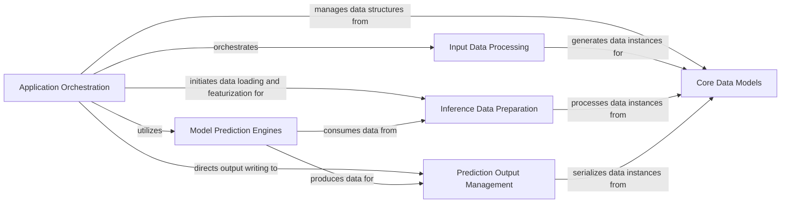

## Component Details

This graph illustrates the core components and their interactions within the Boltz application, focusing on the flow from input data processing to model prediction and output management. The Application Orchestration component acts as the central control unit, coordinating the entire workflow by interacting with specialized components for data parsing, model inference preparation, prediction execution, and result serialization. Data models serve as the foundational structures for data exchange across these components.

### Application Orchestration
Serves as the central control unit for the Boltz application, managing the overall workflow from input processing to model prediction. It coordinates data flow and execution across different modules.

**Related Classes/Methods**:

- <a href="https://github.com/jwohlwend/boltz/blob/master/src/boltz/main.py#L311-L352" target="_blank" rel="noopener noreferrer">`boltz.src.boltz.main:filter_inputs_structure` (311:352)</a>
- <a href="https://github.com/jwohlwend/boltz/blob/master/src/boltz/main.py#L477-L605" target="_blank" rel="noopener noreferrer">`boltz.src.boltz.main:process_input` (477:605)</a>
- <a href="https://github.com/jwohlwend/boltz/blob/master/src/boltz/main.py#L933-L999" target="_blank" rel="noopener noreferrer">`boltz.src.boltz.main:predict` (933:999)</a>
- <a href="https://github.com/jwohlwend/boltz/blob/master/src/boltz/main.py#L159-L192" target="_blank" rel="noopener noreferrer">`boltz.src.boltz.main.download_boltz1` (159:192)</a>
- <a href="https://github.com/jwohlwend/boltz/blob/master/src/boltz/main.py#L196-L250" target="_blank" rel="noopener noreferrer">`boltz.src.boltz.main.download_boltz2` (196:250)</a>
- <a href="https://github.com/jwohlwend/boltz/blob/master/src/boltz/main.py#L273-L308" target="_blank" rel="noopener noreferrer">`boltz.src.boltz.main.check_inputs` (273:308)</a>
- <a href="https://github.com/jwohlwend/boltz/blob/master/src/boltz/main.py#L609-L728" target="_blank" rel="noopener noreferrer">`boltz.src.boltz.main.process_inputs` (609:728)</a>
- <a href="https://github.com/jwohlwend/boltz/blob/master/src/boltz/main.py#L55-L63" target="_blank" rel="noopener noreferrer">`boltz.src.boltz.main.BoltzProcessedInput` (55:63)</a>
- <a href="https://github.com/jwohlwend/boltz/blob/master/src/boltz/main.py#L128-L143" target="_blank" rel="noopener noreferrer">`boltz.src.boltz.main.Boltz2DiffusionParams` (128:143)</a>
- <a href="https://github.com/jwohlwend/boltz/blob/master/src/boltz/main.py#L79-L87" target="_blank" rel="noopener noreferrer">`boltz.src.boltz.main.PairformerArgsV2` (79:87)</a>
- <a href="https://github.com/jwohlwend/boltz/blob/master/src/boltz/main.py#L108-L124" target="_blank" rel="noopener noreferrer">`boltz.src.boltz.main.BoltzDiffusionParams` (108:124)</a>
- <a href="https://github.com/jwohlwend/boltz/blob/master/src/boltz/main.py#L67-L75" target="_blank" rel="noopener noreferrer">`boltz.src.boltz.main.PairformerArgs` (67:75)</a>
- <a href="https://github.com/jwohlwend/boltz/blob/master/src/boltz/main.py#L91-L104" target="_blank" rel="noopener noreferrer">`boltz.src.boltz.main.MSAModuleArgs` (91:104)</a>
- <a href="https://github.com/jwohlwend/boltz/blob/master/src/boltz/main.py#L147-L155" target="_blank" rel="noopener noreferrer">`boltz.src.boltz.main.BoltzSteeringParams` (147:155)</a>
- <a href="https://github.com/jwohlwend/boltz/blob/master/src/boltz/main.py#L355-L401" target="_blank" rel="noopener noreferrer">`boltz.src.boltz.main.filter_inputs_affinity` (355:401)</a>

### Input Data Processing
This component is responsible for parsing various raw input file formats (FASTA, YAML, A3M, CSV) into a standardized internal data representation. It ensures that external data is correctly interpreted and structured for further processing.

**Related Classes/Methods**:

- <a href="https://github.com/jwohlwend/boltz/blob/master/src/boltz/data/parse/fasta.py#L11-L138" target="_blank" rel="noopener noreferrer">`boltz.data.parse.fasta.parse_fasta` (11:138)</a>
- <a href="https://github.com/jwohlwend/boltz/blob/master/src/boltz/data/parse/yaml.py#L10-L68" target="_blank" rel="noopener noreferrer">`boltz.data.parse.yaml.parse_yaml` (10:68)</a>
- <a href="https://github.com/jwohlwend/boltz/blob/master/src/boltz/data/parse/a3m.py#L104-L134" target="_blank" rel="noopener noreferrer">`boltz.data.parse.a3m.parse_a3m` (104:134)</a>
- <a href="https://github.com/jwohlwend/boltz/blob/master/src/boltz/data/parse/csv.py#L11-L100" target="_blank" rel="noopener noreferrer">`boltz.data.parse.csv.parse_csv` (11:100)</a>

### Core Data Models
This component defines the fundamental data structures and serialization mechanisms used throughout the Boltz system for representing molecular structures, multiple sequence alignments (MSAs), and input records. It facilitates data exchange and persistence.

**Related Classes/Methods**:

- <a href="https://github.com/jwohlwend/boltz/blob/master/src/boltz/data/types.py#L647-L683" target="_blank" rel="noopener noreferrer">`boltz.data.types.Manifest` (647:683)</a>
- <a href="https://github.com/jwohlwend/boltz/blob/master/src/boltz/data/types.py#L15-L44" target="_blank" rel="noopener noreferrer">`boltz.data.types.NumpySerializable` (15:44)</a>
- <a href="https://github.com/jwohlwend/boltz/blob/master/src/boltz/data/types.py#L47-L78" target="_blank" rel="noopener noreferrer">`boltz.data.types.JSONSerializable` (47:78)</a>
- <a href="https://github.com/jwohlwend/boltz/blob/master/src/boltz/data/types.py#L169-L319" target="_blank" rel="noopener noreferrer">`boltz.data.types.Structure` (169:319)</a>
- <a href="https://github.com/jwohlwend/boltz/blob/master/src/boltz/data/types.py#L323-L441" target="_blank" rel="noopener noreferrer">`boltz.data.types.StructureV2` (323:441)</a>
- <a href="https://github.com/jwohlwend/boltz/blob/master/src/boltz/data/types.py#L469-L474" target="_blank" rel="noopener noreferrer">`boltz.data.types.MSA` (469:474)</a>
- <a href="https://github.com/jwohlwend/boltz/blob/master/src/boltz/data/types.py#L566-L576" target="_blank" rel="noopener noreferrer">`boltz.data.types.Record` (566:576)</a>
- <a href="https://github.com/jwohlwend/boltz/blob/master/src/boltz/data/types.py#L692-L700" target="_blank" rel="noopener noreferrer">`boltz.data.types.Input` (692:700)</a>

### Inference Data Preparation
This component handles the loading, tokenization, and featurization of data specifically for the prediction models. It prepares the input data in the correct format and with the necessary features for the inference process.

**Related Classes/Methods**:

- <a href="https://github.com/jwohlwend/boltz/blob/master/src/boltz/data/module/inferencev2.py#L313-L429" target="_blank" rel="noopener noreferrer">`boltz.data.module.inferencev2.Boltz2InferenceDataModule` (313:429)</a>
- <a href="https://github.com/jwohlwend/boltz/blob/master/src/boltz/data/module/inference.py#L223-L307" target="_blank" rel="noopener noreferrer">`boltz.data.module.inference.BoltzInferenceDataModule` (223:307)</a>
- <a href="https://github.com/jwohlwend/boltz/blob/master/src/boltz/data/module/inferencev2.py#L27-L109" target="_blank" rel="noopener noreferrer">`boltz.data.module.inferencev2.Boltz2InferenceDataModule.load_input` (27:109)</a>
- <a href="https://github.com/jwohlwend/boltz/blob/master/src/boltz/data/module/inferencev2.py#L112-L154" target="_blank" rel="noopener noreferrer">`boltz.data.module.inferencev2.Boltz2InferenceDataModule.collate` (112:154)</a>
- <a href="https://github.com/jwohlwend/boltz/blob/master/src/boltz/data/module/inferencev2.py#L157-L310" target="_blank" rel="noopener noreferrer">`boltz.data.module.inferencev2.Boltz2InferenceDataModule.PredictionDataset` (157:310)</a>
- <a href="https://github.com/jwohlwend/boltz/blob/master/src/boltz/data/module/inference.py#L25-L74" target="_blank" rel="noopener noreferrer">`boltz.data.module.inference.BoltzInferenceDataModule.load_input` (25:74)</a>
- <a href="https://github.com/jwohlwend/boltz/blob/master/src/boltz/data/module/inference.py#L77-L118" target="_blank" rel="noopener noreferrer">`boltz.data.module.inference.BoltzInferenceDataModule.collate` (77:118)</a>
- <a href="https://github.com/jwohlwend/boltz/blob/master/src/boltz/data/module/inference.py#L121-L220" target="_blank" rel="noopener noreferrer">`boltz.data.module.inference.BoltzInferenceDataModule.PredictionDataset` (121:220)</a>
- <a href="https://github.com/jwohlwend/boltz/blob/master/src/boltz/data/tokenize/boltz2.py#L349-L396" target="_blank" rel="noopener noreferrer">`boltz.data.tokenize.boltz2.Boltz2Tokenizer` (349:396)</a>
- <a href="https://github.com/jwohlwend/boltz/blob/master/src/boltz/data/tokenize/boltz.py#L32-L195" target="_blank" rel="noopener noreferrer">`boltz.data.tokenize.boltz.BoltzTokenizer` (32:195)</a>
- `boltz.data.feature.featurizerv2.Boltz2Featurizer` (full file reference)
- `boltz.data.feature.featurizer.BoltzFeaturizer` (full file reference)

### Prediction Output Management
This component is dedicated to writing the results of the prediction process to disk. It supports various output formats for structural predictions and handles the saving of affinity prediction summaries.

**Related Classes/Methods**:

- <a href="https://github.com/jwohlwend/boltz/blob/master/src/boltz/data/write/writer.py#L17-L254" target="_blank" rel="noopener noreferrer">`boltz.data.write.writer.BoltzWriter` (17:254)</a>
- <a href="https://github.com/jwohlwend/boltz/blob/master/src/boltz/data/write/writer.py#L257-L330" target="_blank" rel="noopener noreferrer">`boltz.data.write.writer.BoltzAffinityWriter` (257:330)</a>

### Model Prediction Engines
This component encapsulates the core prediction models (Boltz1 and Boltz2) responsible for performing the actual molecular structure and affinity predictions. It takes prepared input data and generates the predicted outputs.

**Related Classes/Methods**:

- `boltz.model.models.boltz1` (full file reference)
- `boltz.model.models.boltz2` (full file reference)

### [FAQ](https://github.com/CodeBoarding/GeneratedOnBoardings/tree/main?tab=readme-ov-file#faq)