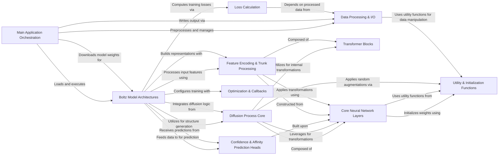

## Component Details

The Boltz system is designed for predicting molecular structures, confidence metrics, and binding affinities. It orchestrates a complex pipeline that begins with input data processing, including validation and MSA generation. The system then loads and utilizes pre-trained Boltz neural network models (Boltz1 and Boltz2) which incorporate sophisticated diffusion mechanisms for structure generation, alongside dedicated modules for confidence and affinity predictions. The core of the models relies on various neural network layers and transformer blocks for feature encoding and trunk processing. During training, it leverages specific loss functions and optimization strategies. Finally, it handles the output of predictions by writing them to appropriate file formats.

### Main Application Orchestration
This component orchestrates the entire prediction pipeline. It handles input data validation, preprocessing (MSA generation, parsing), model downloading, model loading, and writing the final predictions. It acts as the central control flow for the Boltz application.

**Related Classes/Methods**:

- <a href="https://github.com/jwohlwend/boltz/blob/master/src/boltz/main.py#L933-L999" target="_blank" rel="noopener noreferrer">`boltz.src.boltz.main:predict` (933:999)</a>
- <a href="https://github.com/jwohlwend/boltz/blob/master/src/boltz/main.py#L159-L192" target="_blank" rel="noopener noreferrer">`boltz.src.boltz.main:download_boltz1` (159:192)</a>
- <a href="https://github.com/jwohlwend/boltz/blob/master/src/boltz/main.py#L196-L250" target="_blank" rel="noopener noreferrer">`boltz.src.boltz.main:download_boltz2` (196:250)</a>
- <a href="https://github.com/jwohlwend/boltz/blob/master/src/boltz/main.py#L273-L308" target="_blank" rel="noopener noreferrer">`boltz.src.boltz.main:check_inputs` (273:308)</a>
- <a href="https://github.com/jwohlwend/boltz/blob/master/src/boltz/main.py#L609-L728" target="_blank" rel="noopener noreferrer">`boltz.src.boltz.main:process_inputs` (609:728)</a>
- <a href="https://github.com/jwohlwend/boltz/blob/master/src/boltz/main.py#L311-L352" target="_blank" rel="noopener noreferrer">`boltz.src.boltz.main:filter_inputs_structure` (311:352)</a>
- <a href="https://github.com/jwohlwend/boltz/blob/master/src/boltz/main.py#L355-L401" target="_blank" rel="noopener noreferrer">`boltz.src.boltz.main:filter_inputs_affinity` (355:401)</a>
- <a href="https://github.com/jwohlwend/boltz/blob/master/src/boltz/data/write/writer.py#L17-L254" target="_blank" rel="noopener noreferrer">`boltz.data.write.writer.BoltzWriter` (17:254)</a>
- <a href="https://github.com/jwohlwend/boltz/blob/master/src/boltz/data/write/writer.py#L257-L330" target="_blank" rel="noopener noreferrer">`boltz.data.write.writer.BoltzAffinityWriter` (257:330)</a>
- <a href="https://github.com/jwohlwend/boltz/blob/master/src/boltz/data/module/inferencev2.py#L313-L429" target="_blank" rel="noopener noreferrer">`boltz.data.module.inferencev2.Boltz2InferenceDataModule` (313:429)</a>
- <a href="https://github.com/jwohlwend/boltz/blob/master/src/boltz/data/module/inference.py#L223-L307" target="_blank" rel="noopener noreferrer">`boltz.data.module.inference.BoltzInferenceDataModule` (223:307)</a>

### Boltz Model Architectures
This component encapsulates the high-level structure and behavior of Boltz1 and Boltz2 models, including their training, validation, and prediction loops.

**Related Classes/Methods**:

- <a href="https://github.com/jwohlwend/boltz/blob/master/src/boltz/model/models/boltz1.py#L16-L300" target="_blank" rel="noopener noreferrer">`boltz.src.boltz.model.models.boltz1.Boltz1` (16:300)</a>
- <a href="https://github.com/jwohlwend/boltz/blob/master/src/boltz/model/models/boltz2.py#L16-L300" target="_blank" rel="noopener noreferrer">`boltz.src.boltz.model.models.boltz2.Boltz2` (16:300)</a>

### Diffusion Process Core
This component implements the central diffusion mechanism for generating molecular structures, including noise handling, sampling, and potential-based steering.

**Related Classes/Methods**:

- <a href="https://github.com/jwohlwend/boltz/blob/master/src/boltz/model/modules/diffusionv2.py#L38-L176" target="_blank" rel="noopener noreferrer">`boltz.src.boltz.model.modules.diffusionv2.DiffusionModule` (38:176)</a>
- <a href="https://github.com/jwohlwend/boltz/blob/master/src/boltz/model/modules/diffusionv2.py#L179-L677" target="_blank" rel="noopener noreferrer">`boltz.src.boltz.model.modules.diffusionv2.AtomDiffusion` (179:677)</a>
- <a href="https://github.com/jwohlwend/boltz/blob/master/src/boltz/model/modules/diffusion.py#L41-L229" target="_blank" rel="noopener noreferrer">`boltz.src.boltz.model.modules.diffusion.DiffusionModule` (41:229)</a>
- <a href="https://github.com/jwohlwend/boltz/blob/master/src/boltz/model/modules/diffusion.py#L284-L844" target="_blank" rel="noopener noreferrer">`boltz.src.boltz.model.modules.diffusion.AtomDiffusion` (284:844)</a>
- <a href="https://github.com/jwohlwend/boltz/blob/master/src/boltz/model/modules/diffusion.py#L232-L281" target="_blank" rel="noopener noreferrer">`boltz.src.boltz.model.modules.diffusion.OutTokenFeatUpdate` (232:281)</a>
- <a href="https://github.com/jwohlwend/boltz/blob/master/src/boltz/model/potentials/potentials.py#L417-L482" target="_blank" rel="noopener noreferrer">`boltz.src.boltz.model.potentials.potentials:get_potentials` (417:482)</a>
- <a href="https://github.com/jwohlwend/boltz/blob/master/src/boltz/model/potentials/potentials.py#L318-L347" target="_blank" rel="noopener noreferrer">`boltz.src.boltz.model.potentials.potentials.SymmetricChainCOMPotential` (318:347)</a>
- <a href="https://github.com/jwohlwend/boltz/blob/master/src/boltz/model/potentials/potentials.py#L257-L315" target="_blank" rel="noopener noreferrer">`boltz.src.boltz.model.potentials.potentials.VDWOverlapPotential` (257:315)</a>
- <a href="https://github.com/jwohlwend/boltz/blob/master/src/boltz/model/potentials/potentials.py#L245-L254" target="_blank" rel="noopener noreferrer">`boltz.src.boltz.model.potentials.potentials.ConnectionsPotential` (245:254)</a>
- <a href="https://github.com/jwohlwend/boltz/blob/master/src/boltz/model/potentials/potentials.py#L219-L242" target="_blank" rel="noopener noreferrer">`boltz.src.boltz.model.potentials.potentials.PoseBustersPotential` (219:242)</a>
- <a href="https://github.com/jwohlwend/boltz/blob/master/src/boltz/model/potentials/potentials.py#L371-L388" target="_blank" rel="noopener noreferrer">`boltz.src.boltz.model.potentials.potentials.ChiralAtomPotential` (371:388)</a>
- <a href="https://github.com/jwohlwend/boltz/blob/master/src/boltz/model/potentials/potentials.py#L350-L368" target="_blank" rel="noopener noreferrer">`boltz.src.boltz.model.potentials.potentials.StereoBondPotential` (350:368)</a>
- <a href="https://github.com/jwohlwend/boltz/blob/master/src/boltz/model/potentials/potentials.py#L391-L414" target="_blank" rel="noopener noreferrer">`boltz.src.boltz.model.potentials.potentials.PlanarBondPotential` (391:414)</a>
- <a href="https://github.com/jwohlwend/boltz/blob/master/src/boltz/model/potentials/schedules.py#L8-L18" target="_blank" rel="noopener noreferrer">`boltz.model.potentials.schedules.ExponentialInterpolation` (8:18)</a>
- <a href="https://github.com/jwohlwend/boltz/blob/master/src/boltz/model/potentials/schedules.py#L20-L32" target="_blank" rel="noopener noreferrer">`boltz.model.potentials.schedules.PiecewiseStepFunction` (20:32)</a>

### Confidence & Affinity Prediction Heads
Modules specifically designed for predicting confidence metrics (pLDDT, pAE) and molecular binding affinity.

**Related Classes/Methods**:

- <a href="https://github.com/jwohlwend/boltz/blob/master/src/boltz/model/modules/confidencev2.py#L19-L237" target="_blank" rel="noopener noreferrer">`boltz.src.boltz.model.modules.confidencev2.ConfidenceModule` (19:237)</a>
- <a href="https://github.com/jwohlwend/boltz/blob/master/src/boltz/model/modules/confidencev2.py#L240-L503" target="_blank" rel="noopener noreferrer">`boltz.src.boltz.model.modules.confidencev2.ConfidenceHeads` (240:503)</a>
- <a href="https://github.com/jwohlwend/boltz/blob/master/src/boltz/model/modules/confidence.py#L20-L334" target="_blank" rel="noopener noreferrer">`boltz.src.boltz.model.modules.confidence.ConfidenceModule` (20:334)</a>
- <a href="https://github.com/jwohlwend/boltz/blob/master/src/boltz/model/modules/confidence.py#L337-L481" target="_blank" rel="noopener noreferrer">`boltz.src.boltz.model.modules.confidence.ConfidenceHeads` (337:481)</a>
- <a href="https://github.com/jwohlwend/boltz/blob/master/src/boltz/model/modules/affinity.py#L34-L135" target="_blank" rel="noopener noreferrer">`boltz.src.boltz.model.modules.affinity.AffinityModule` (34:135)</a>
- <a href="https://github.com/jwohlwend/boltz/blob/master/src/boltz/model/modules/affinity.py#L138-L219" target="_blank" rel="noopener noreferrer">`boltz.src.boltz.model.modules.affinity.AffinityHeadsTransformer` (138:219)</a>

### Core Neural Network Layers
Fundamental building blocks of the neural networks, including various attention mechanisms, triangular multiplications, and transition blocks.

**Related Classes/Methods**:

- <a href="https://github.com/jwohlwend/boltz/blob/master/src/boltz/model/layers/pairformer.py#L21-L107" target="_blank" rel="noopener noreferrer">`boltz.src.boltz.model.layers.pairformer.PairformerLayer` (21:107)</a>
- <a href="https://github.com/jwohlwend/boltz/blob/master/src/boltz/model/layers/pairformer.py#L110-L195" target="_blank" rel="noopener noreferrer">`boltz.src.boltz.model.layers.pairformer.PairformerModule` (110:195)</a>
- <a href="https://github.com/jwohlwend/boltz/blob/master/src/boltz/model/layers/pairformer.py#L198-L257" target="_blank" rel="noopener noreferrer">`boltz.src.boltz.model.layers.pairformer.PairformerNoSeqLayer` (198:257)</a>
- <a href="https://github.com/jwohlwend/boltz/blob/master/src/boltz/model/layers/pairformer.py#L260-L314" target="_blank" rel="noopener noreferrer">`boltz.src.boltz.model.layers.pairformer.PairformerNoSeqModule` (260:314)</a>
- <a href="https://github.com/jwohlwend/boltz/blob/master/src/boltz/model/layers/triangular_mult.py#L7-L74" target="_blank" rel="noopener noreferrer">`boltz.src.boltz.model.layers.triangular_mult.TriangleMultiplicationOutgoing` (7:74)</a>
- <a href="https://github.com/jwohlwend/boltz/blob/master/src/boltz/model/layers/triangular_mult.py#L77-L144" target="_blank" rel="noopener noreferrer">`boltz.src.boltz.model.layers.triangular_mult.TriangleMultiplicationIncoming` (77:144)</a>
- <a href="https://github.com/jwohlwend/boltz/blob/master/src/boltz/model/layers/triangular_attention/attention.py#L33-L162" target="_blank" rel="noopener noreferrer">`boltz.src.boltz.model.layers.triangular_attention.attention.TriangleAttention` (33:162)</a>
- <a href="https://github.com/jwohlwend/boltz/blob/master/src/boltz/model/layers/triangular_attention/attention.py#L169-L172" target="_blank" rel="noopener noreferrer">`boltz.src.boltz.model.layers.triangular_attention.attention.TriangleAttentionEndingNode` (169:172)</a>
- <a href="https://github.com/jwohlwend/boltz/blob/master/src/boltz/model/layers/attention.py#L8-L132" target="_blank" rel="noopener noreferrer">`boltz.src.boltz.model.layers.attention.AttentionPairBias` (8:132)</a>
- <a href="https://github.com/jwohlwend/boltz/blob/master/src/boltz/model/layers/attentionv2.py#L10-L111" target="_blank" rel="noopener noreferrer">`boltz.src.boltz.model.layers.attentionv2.AttentionPairBias` (10:111)</a>
- <a href="https://github.com/jwohlwend/boltz/blob/master/src/boltz/model/layers/transition.py#L8-L78" target="_blank" rel="noopener noreferrer">`boltz.src.boltz.model.layers.transition.Transition` (8:78)</a>
- <a href="https://github.com/jwohlwend/boltz/blob/master/src/boltz/model/layers/pair_averaging.py#L7-L135" target="_blank" rel="noopener noreferrer">`boltz.src.boltz.model.layers.pair_averaging.PairWeightedAveraging` (7:135)</a>
- <a href="https://github.com/jwohlwend/boltz/blob/master/src/boltz/model/layers/outer_product_mean.py#L7-L98" target="_blank" rel="noopener noreferrer">`boltz.src.boltz.model.layers.outer_product_mean.OuterProductMean` (7:98)</a>

### Feature Encoding & Trunk Processing
Modules responsible for encoding input features (single, pairwise, atom-level) and the main 'trunk' of the network that processes these features through a series of layers.

**Related Classes/Methods**:

- <a href="https://github.com/jwohlwend/boltz/blob/master/src/boltz/model/modules/encoders.py#L136-L206" target="_blank" rel="noopener noreferrer">`boltz.src.boltz.model.modules.encoders.SingleConditioning` (136:206)</a>
- <a href="https://github.com/jwohlwend/boltz/blob/master/src/boltz/model/modules/encoders.py#L209-L260" target="_blank" rel="noopener noreferrer">`boltz.src.boltz.model.modules.encoders.PairwiseConditioning` (209:260)</a>
- <a href="https://github.com/jwohlwend/boltz/blob/master/src/boltz/model/modules/encoders.py#L288-L540" target="_blank" rel="noopener noreferrer">`boltz.src.boltz.model.modules.encoders.AtomAttentionEncoder` (288:540)</a>
- <a href="https://github.com/jwohlwend/boltz/blob/master/src/boltz/model/modules/encoders.py#L543-L639" target="_blank" rel="noopener noreferrer">`boltz.src.boltz.model.modules.encoders.AtomAttentionDecoder` (543:639)</a>
- <a href="https://github.com/jwohlwend/boltz/blob/master/src/boltz/model/modules/encodersv2.py#L123-L177" target="_blank" rel="noopener noreferrer">`boltz.src.boltz.model.modules.encodersv2.SingleConditioning` (123:177)</a>
- <a href="https://github.com/jwohlwend/boltz/blob/master/src/boltz/model/modules/encodersv2.py#L180-L217" target="_blank" rel="noopener noreferrer">`boltz.src.boltz.model.modules.encodersv2.PairwiseConditioning` (180:217)</a>
- <a href="https://github.com/jwohlwend/boltz/blob/master/src/boltz/model/modules/encodersv2.py#L245-L411" target="_blank" rel="noopener noreferrer">`boltz.src.boltz.model.modules.encodersv2.AtomEncoder` (245:411)</a>
- <a href="https://github.com/jwohlwend/boltz/blob/master/src/boltz/model/modules/encodersv2.py#L414-L492" target="_blank" rel="noopener noreferrer">`boltz.src.boltz.model.modules.encodersv2.AtomAttentionEncoder` (414:492)</a>
- <a href="https://github.com/jwohlwend/boltz/blob/master/src/boltz/model/modules/encodersv2.py#L495-L565" target="_blank" rel="noopener noreferrer">`boltz.src.boltz.model.modules.encodersv2.AtomAttentionDecoder` (495:565)</a>
- <a href="https://github.com/jwohlwend/boltz/blob/master/src/boltz/model/modules/trunk.py#L24-L113" target="_blank" rel="noopener noreferrer">`boltz.src.boltz.model.modules.trunk.InputEmbedder` (24:113)</a>
- <a href="https://github.com/jwohlwend/boltz/blob/master/src/boltz/model/modules/trunk.py#L116-L289" target="_blank" rel="noopener noreferrer">`boltz.src.boltz.model.modules.trunk.MSAModule` (116:289)</a>
- <a href="https://github.com/jwohlwend/boltz/blob/master/src/boltz/model/modules/trunk.py#L292-L421" target="_blank" rel="noopener noreferrer">`boltz.src.boltz.model.modules.trunk.MSALayer` (292:421)</a>
- <a href="https://github.com/jwohlwend/boltz/blob/master/src/boltz/model/modules/trunk.py#L424-L549" target="_blank" rel="noopener noreferrer">`boltz.src.boltz.model.modules.trunk.PairformerModule` (424:549)</a>
- <a href="https://github.com/jwohlwend/boltz/blob/master/src/boltz/model/modules/trunk.py#L552-L648" target="_blank" rel="noopener noreferrer">`boltz.src.boltz.model.modules.trunk.PairformerLayer` (552:648)</a>
- <a href="https://github.com/jwohlwend/boltz/blob/master/src/boltz/model/modules/trunkv2.py#L21-L65" target="_blank" rel="noopener noreferrer">`boltz.src.boltz.model.modules.trunkv2.ContactConditioning` (21:65)</a>
- <a href="https://github.com/jwohlwend/boltz/blob/master/src/boltz/model/modules/trunkv2.py#L68-L208" target="_blank" rel="noopener noreferrer">`boltz.src.boltz.model.modules.trunkv2.InputEmbedder` (68:208)</a>
- <a href="https://github.com/jwohlwend/boltz/blob/master/src/boltz/model/modules/trunkv2.py#L211-L358" target="_blank" rel="noopener noreferrer">`boltz.src.boltz.model.modules.trunkv2.TemplateModule` (211:358)</a>
- <a href="https://github.com/jwohlwend/boltz/blob/master/src/boltz/model/modules/trunkv2.py#L361-L509" target="_blank" rel="noopener noreferrer">`boltz.src.boltz.model.modules.trunkv2.TemplateV2Module` (361:509)</a>
- <a href="https://github.com/jwohlwend/boltz/blob/master/src/boltz/model/modules/trunkv2.py#L512-L669" target="_blank" rel="noopener noreferrer">`boltz.src.boltz.model.modules.trunkv2.MSAModule` (512:669)</a>
- <a href="https://github.com/jwohlwend/boltz/blob/master/src/boltz/model/modules/trunkv2.py#L672-L758" target="_blank" rel="noopener noreferrer">`boltz.src.boltz.model.modules.trunkv2.MSALayer` (672:758)</a>
- <a href="https://github.com/jwohlwend/boltz/blob/master/src/boltz/model/modules/trunkv2.py#L794-L828" target="_blank" rel="noopener noreferrer">`boltz.src.boltz.model.modules.trunkv2.DistogramModule` (794:828)</a>
- <a href="https://github.com/jwohlwend/boltz/blob/master/src/boltz/model/modules/trunkv2.py#L761-L791" target="_blank" rel="noopener noreferrer">`boltz.src.boltz.model.modules.trunkv2.BFactorModule` (761:791)</a>
- <a href="https://github.com/jwohlwend/boltz/blob/master/src/boltz/model/modules/diffusion_conditioning.py#L13-L116" target="_blank" rel="noopener noreferrer">`boltz.src.boltz.model.modules.diffusion_conditioning.DiffusionConditioning` (13:116)</a>

### Transformer Blocks
Reusuable transformer-based blocks used within various modules for sequence and pair transformations.

**Related Classes/Methods**:

- <a href="https://github.com/jwohlwend/boltz/blob/master/src/boltz/model/modules/transformersv2.py#L34-L65" target="_blank" rel="noopener noreferrer">`boltz.src.boltz.model.modules.transformersv2.ConditionedTransitionBlock` (34:65)</a>
- <a href="https://github.com/jwohlwend/boltz/blob/master/src/boltz/model/modules/transformersv2.py#L68-L137" target="_blank" rel="noopener noreferrer">`boltz.src.boltz.model.modules.transformersv2.DiffusionTransformer` (68:137)</a>
- <a href="https://github.com/jwohlwend/boltz/blob/master/src/boltz/model/modules/transformersv2.py#L140-L208" target="_blank" rel="noopener noreferrer">`boltz.src.boltz.model.modules.transformersv2.DiffusionTransformerLayer` (140:208)</a>
- <a href="https://github.com/jwohlwend/boltz/blob/master/src/boltz/model/modules/transformersv2.py#L211-L261" target="_blank" rel="noopener noreferrer">`boltz.src.boltz.model.modules.transformersv2.AtomTransformer` (211:261)</a>
- <a href="https://github.com/jwohlwend/boltz/blob/master/src/boltz/model/modules/transformersv2.py#L17-L31" target="_blank" rel="noopener noreferrer">`boltz.src.boltz.model.modules.transformersv2.AdaLN` (17:31)</a>
- <a href="https://github.com/jwohlwend/boltz/blob/master/src/boltz/model/modules/transformers.py#L44-L87" target="_blank" rel="noopener noreferrer">`boltz.src.boltz.model.modules.transformers.ConditionedTransitionBlock` (44:87)</a>
- <a href="https://github.com/jwohlwend/boltz/blob/master/src/boltz/model/modules/transformers.py#L90-L177" target="_blank" rel="noopener noreferrer">`boltz.src.boltz.model.modules.transformers.DiffusionTransformer` (90:177)</a>
- <a href="https://github.com/jwohlwend/boltz/blob/master/src/boltz/model/modules/transformers.py#L180-L249" target="_blank" rel="noopener noreferrer">`boltz.src.boltz.model.modules.transformers.DiffusionTransformerLayer` (180:249)</a>
- <a href="https://github.com/jwohlwend/boltz/blob/master/src/boltz/model/modules/transformers.py#L252-L322" target="_blank" rel="noopener noreferrer">`boltz.src.boltz.model.modules.transformers.AtomTransformer` (252:322)</a>
- <a href="https://github.com/jwohlwend/boltz/blob/master/src/boltz/model/modules/transformers.py#L17-L41" target="_blank" rel="noopener noreferrer">`boltz.src.boltz.model.modules.transformers.AdaLN` (17:41)</a>

### Loss Calculation
Provides functions for computing various loss terms used during model training.

**Related Classes/Methods**:

- <a href="https://github.com/jwohlwend/boltz/blob/master/src/boltz/model/loss/confidencev2.py#L8-L87" target="_blank" rel="noopener noreferrer">`boltz.src.boltz.model.loss.confidencev2:confidence_loss` (8:87)</a>
- <a href="https://github.com/jwohlwend/boltz/blob/master/src/boltz/model/loss/confidencev2.py#L207-L292" target="_blank" rel="noopener noreferrer">`boltz.src.boltz.model.loss.confidencev2:plddt_loss` (207:292)</a>
- <a href="https://github.com/jwohlwend/boltz/blob/master/src/boltz/model/loss/confidencev2.py#L432-L513" target="_blank" rel="noopener noreferrer">`boltz.src.boltz.model.loss.confidencev2:pae_loss` (432:513)</a>
- <a href="https://github.com/jwohlwend/boltz/blob/master/src/boltz/model/loss/confidencev2.py#L542-L621" target="_blank" rel="noopener noreferrer">`boltz.src.boltz.model.loss.confidencev2:pde_loss` (542:621)</a>
- <a href="https://github.com/jwohlwend/boltz/blob/master/src/boltz/model/loss/confidencev2.py#L141-L204" target="_blank" rel="noopener noreferrer">`boltz.src.boltz.model.loss.confidencev2:get_target_lddt` (141:204)</a>
- <a href="https://github.com/jwohlwend/boltz/blob/master/src/boltz/model/loss/confidencev2.py#L355-L429" target="_blank" rel="noopener noreferrer">`boltz.src.boltz.model.loss.confidencev2:get_target_pae` (355:429)</a>
- <a href="https://github.com/jwohlwend/boltz/blob/master/src/boltz/model/loss/confidence.py#L7-L84" target="_blank" rel="noopener noreferrer">`boltz.src.boltz.model.loss.confidence.confidence_loss` (7:84)</a>
- <a href="https://github.com/jwohlwend/boltz/blob/master/src/boltz/model/loss/confidence.py#L136-L239" target="_blank" rel="noopener noreferrer">`boltz.src.boltz.model.loss.confidence.plddt_loss` (136:239)</a>
- <a href="https://github.com/jwohlwend/boltz/blob/master/src/boltz/model/loss/confidence.py#L310-L421" target="_blank" rel="noopener noreferrer">`boltz.src.boltz.model.loss.confidence.pae_loss` (310:421)</a>
- <a href="https://github.com/jwohlwend/boltz/blob/master/src/boltz/model/loss/confidence.py#L494-L590" target="_blank" rel="noopener noreferrer">`boltz.src.boltz.model.loss.confidence.compute_frame_pred` (494:590)</a>
- <a href="https://github.com/jwohlwend/boltz/blob/master/src/boltz/model/loss/diffusionv2.py#L9-L79" target="_blank" rel="noopener noreferrer">`boltz.model.loss.diffusionv2.weighted_rigid_align` (9:79)</a>
- <a href="https://github.com/jwohlwend/boltz/blob/master/src/boltz/model/loss/diffusionv2.py#L82-L134" target="_blank" rel="noopener noreferrer">`boltz.model.loss.diffusionv2.smooth_lddt_loss` (82:134)</a>
- <a href="https://github.com/jwohlwend/boltz/blob/master/src/boltz/model/loss/diffusion.py#L8-L94" target="_blank" rel="noopener noreferrer">`boltz.model.loss.diffusion.weighted_rigid_align` (8:94)</a>
- <a href="https://github.com/jwohlwend/boltz/blob/master/src/boltz/model/loss/diffusion.py#L97-L171" target="_blank" rel="noopener noreferrer">`boltz.model.loss.diffusion.smooth_lddt_loss` (97:171)</a>
- <a href="https://github.com/jwohlwend/boltz/blob/master/src/boltz/model/loss/distogramv2.py#L5-L105" target="_blank" rel="noopener noreferrer">`boltz.model.loss.distogramv2.distogram_loss` (5:105)</a>
- <a href="https://github.com/jwohlwend/boltz/blob/master/src/boltz/model/loss/distogram.py#L5-L48" target="_blank" rel="noopener noreferrer">`boltz.model.loss.distogram.distogram_loss` (5:48)</a>
- <a href="https://github.com/jwohlwend/boltz/blob/master/src/boltz/model/loss/bfactor.py#L5-L49" target="_blank" rel="noopener noreferrer">`boltz.model.loss.bfactor.bfactor_loss_fn` (5:49)</a>
- `boltz.model.loss.validation.factored_token_lddt_dist_loss` (full file reference)
- `boltz.model.loss.validation.factored_lddt_loss` (full file reference)
- `boltz.model.loss.validation.compute_plddt_mae` (full file reference)
- `boltz.model.loss.validation.compute_pde_mae` (full file reference)
- `boltz.model.loss.validation.compute_pae_mae` (full file reference)
- `boltz.model.loss.validation.weighted_minimum_rmsd` (full file reference)

### Utility & Initialization Functions
General utility functions, mathematical operations, and various weight initialization strategies used across the model's layers and modules.

**Related Classes/Methods**:

- <a href="https://github.com/jwohlwend/boltz/blob/master/src/boltz/model/layers/initialize.py#L47-L58" target="_blank" rel="noopener noreferrer">`boltz.src.boltz.model.layers.initialize:trunc_normal_init_` (47:58)</a>
- <a href="https://github.com/jwohlwend/boltz/blob/master/src/boltz/model/layers/initialize.py#L61-L62" target="_blank" rel="noopener noreferrer">`boltz.src.boltz.model.layers.initialize:lecun_normal_init_` (61:62)</a>
- <a href="https://github.com/jwohlwend/boltz/blob/master/src/boltz/model/layers/initialize.py#L65-L66" target="_blank" rel="noopener noreferrer">`boltz.src.boltz.model.layers.initialize:he_normal_init_` (65:66)</a>
- <a href="https://github.com/jwohlwend/boltz/blob/master/src/boltz/model/layers/initialize.py#L88-L90" target="_blank" rel="noopener noreferrer">`boltz.src.boltz.model.layers.initialize:bias_init_one_` (88:90)</a>
- <a href="https://github.com/jwohlwend/boltz/blob/master/src/boltz/model/layers/initialize.py#L83-L85" target="_blank" rel="noopener noreferrer">`boltz.src.boltz.model.layers.initialize:bias_init_zero_` (83:85)</a>
- <a href="https://github.com/jwohlwend/boltz/blob/master/src/boltz/model/layers/initialize.py#L69-L70" target="_blank" rel="noopener noreferrer">`boltz.src.boltz.model.layers.initialize:glorot_uniform_init_` (69:70)</a>
- <a href="https://github.com/jwohlwend/boltz/blob/master/src/boltz/model/layers/initialize.py#L78-L80" target="_blank" rel="noopener noreferrer">`boltz.src.boltz.model.layers.initialize:gating_init_` (78:80)</a>
- <a href="https://github.com/jwohlwend/boltz/blob/master/src/boltz/model/layers/initialize.py#L93-L94" target="_blank" rel="noopener noreferrer">`boltz.src.boltz.model.layers.initialize:normal_init_` (93:94)</a>
- <a href="https://github.com/jwohlwend/boltz/blob/master/src/boltz/model/layers/initialize.py#L73-L75" target="_blank" rel="noopener noreferrer">`boltz.src.boltz.model.layers.initialize:final_init_` (73:75)</a>
- <a href="https://github.com/jwohlwend/boltz/blob/master/src/boltz/model/layers/initialize.py#L32-L44" target="_blank" rel="noopener noreferrer">`boltz.src.boltz.model.layers.initialize._calculate_fan` (32:44)</a>
- <a href="https://github.com/jwohlwend/boltz/blob/master/src/boltz/model/layers/initialize.py#L25-L29" target="_blank" rel="noopener noreferrer">`boltz.src.boltz.model.layers.initialize._prod` (25:29)</a>
- <a href="https://github.com/jwohlwend/boltz/blob/master/src/boltz/model/modules/utils.py#L21-L22" target="_blank" rel="noopener noreferrer">`boltz.src.boltz.model.modules.utils:default` (21:22)</a>
- <a href="https://github.com/jwohlwend/boltz/blob/master/src/boltz/model/modules/utils.py#L17-L18" target="_blank" rel="noopener noreferrer">`boltz.src.boltz.model.modules.utils:exists` (17:18)</a>
- <a href="https://github.com/jwohlwend/boltz/blob/master/src/boltz/model/modules/utils.py#L46-L53" target="_blank" rel="noopener noreferrer">`boltz.src.boltz.model.modules.utils:compute_random_augmentation` (46:53)</a>
- <a href="https://github.com/jwohlwend/boltz/blob/master/src/boltz/model/modules/utils.py#L56-L64" target="_blank" rel="noopener noreferrer">`boltz.src.boltz.model.modules.utils:randomly_rotate` (56:64)</a>
- <a href="https://github.com/jwohlwend/boltz/blob/master/src/boltz/model/modules/utils.py#L67-L100" target="_blank" rel="noopener noreferrer">`boltz.src.boltz.model.modules.utils:center_random_augmentation` (67:100)</a>
- <a href="https://github.com/jwohlwend/boltz/blob/master/src/boltz/model/modules/utils.py#L263-L284" target="_blank" rel="noopener noreferrer">`boltz.src.boltz.model.modules.utils:random_quaternions` (263:284)</a>
- <a href="https://github.com/jwohlwend/boltz/blob/master/src/boltz/model/modules/utils.py#L287-L303" target="_blank" rel="noopener noreferrer">`boltz.src.boltz.model.modules.utils:random_rotations` (287:303)</a>
- <a href="https://github.com/jwohlwend/boltz/blob/master/src/boltz/model/modules/utils.py#L231-L260" target="_blank" rel="noopener noreferrer">`boltz.src.boltz.model.modules.utils:quaternion_to_matrix` (231:260)</a>
- <a href="https://github.com/jwohlwend/boltz/blob/master/src/boltz/model/modules/utils.py#L25-L26" target="_blank" rel="noopener noreferrer">`boltz.src.boltz.model.modules.utils:log` (25:26)</a>
- <a href="https://github.com/jwohlwend/boltz/blob/master/src/boltz/model/modules/utils.py#L29-L35" target="_blank" rel="noopener noreferrer">`boltz.src.boltz.model.modules.utils.SwiGLU` (29:35)</a>
- <a href="https://github.com/jwohlwend/boltz/blob/master/src/boltz/model/modules/utils.py#L103-L207" target="_blank" rel="noopener noreferrer">`boltz.src.boltz.model.modules.utils.ExponentialMovingAverage` (103:207)</a>

### Optimization & Callbacks
Handles optimization strategies and training callbacks, such as learning rate scheduling and Exponential Moving Average (EMA).

**Related Classes/Methods**:

- <a href="https://github.com/jwohlwend/boltz/blob/master/src/boltz/model/optim/scheduler.py#L4-L99" target="_blank" rel="noopener noreferrer">`boltz.src.boltz.model.optim.scheduler.AlphaFoldLRScheduler` (4:99)</a>
- <a href="https://github.com/jwohlwend/boltz/blob/master/src/boltz/model/optim/ema.py#L14-L389" target="_blank" rel="noopener noreferrer">`boltz.src.boltz.model.optim.ema.EMA` (14:389)</a>

### Data Processing & I/O
This component is responsible for all data-related operations, including cropping, feature extraction, filtering, parsing various input formats (A3M, CSV, FASTA, MMCIF, YAML), sampling, tokenization, and writing output files (MMCIF, PDB). It ensures data is correctly prepared for model inference and training, and results are stored appropriately.

**Related Classes/Methods**:

- <a href="https://github.com/jwohlwend/boltz/blob/master/src/boltz/data/crop/affinity.py#L11-L164" target="_blank" rel="noopener noreferrer">`boltz.data.crop.affinity.AffinityCropper` (11:164)</a>
- <a href="https://github.com/jwohlwend/boltz/blob/master/src/boltz/data/crop/boltz.py#L127-L296" target="_blank" rel="noopener noreferrer">`boltz.data.crop.boltz.BoltzCropper` (127:296)</a>
- <a href="https://github.com/jwohlwend/boltz/blob/master/src/boltz/data/crop/cropper.py#L9-L45" target="_blank" rel="noopener noreferrer">`boltz.data.crop.cropper.Cropper` (9:45)</a>
- `boltz.data.feature.featurizer.BoltzFeaturizer` (full file reference)
- `boltz.data.feature.featurizerv2.Boltz2Featurizer` (full file reference)
- `boltz.data.feature.symmetry.Symmetry` (full file reference)
- <a href="https://github.com/jwohlwend/boltz/blob/master/src/boltz/data/filter/dynamic/date.py#L8-L76" target="_blank" rel="noopener noreferrer">`boltz.data.filter.dynamic.date.DateFilter` (8:76)</a>
- <a href="https://github.com/jwohlwend/boltz/blob/master/src/boltz/data/filter/dynamic/filter.py#L6-L24" target="_blank" rel="noopener noreferrer">`boltz.data.filter.dynamic.filter.DynamicFilter` (6:24)</a>
- <a href="https://github.com/jwohlwend/boltz/blob/master/src/boltz/data/filter/dynamic/max_residues.py#L5-L37" target="_blank" rel="noopener noreferrer">`boltz.data.filter.dynamic.max_residues.MaxResiduesFilter` (5:37)</a>
- <a href="https://github.com/jwohlwend/boltz/blob/master/src/boltz/data/filter/dynamic/resolution.py#L5-L34" target="_blank" rel="noopener noreferrer">`boltz.data.filter.dynamic.resolution.ResolutionFilter` (5:34)</a>
- <a href="https://github.com/jwohlwend/boltz/blob/master/src/boltz/data/filter/dynamic/size.py#L5-L38" target="_blank" rel="noopener noreferrer">`boltz.data.filter.dynamic.size.SizeFilter` (5:38)</a>
- <a href="https://github.com/jwohlwend/boltz/blob/master/src/boltz/data/filter/dynamic/subset.py#L7-L42" target="_blank" rel="noopener noreferrer">`boltz.data.filter.dynamic.subset.SubsetFilter` (7:42)</a>
- <a href="https://github.com/jwohlwend/boltz/blob/master/src/boltz/data/filter/static/filter.py#L8-L26" target="_blank" rel="noopener noreferrer">`boltz.data.filter.static.filter.StaticFilter` (8:26)</a>
- <a href="https://github.com/jwohlwend/boltz/blob/master/src/boltz/data/filter/static/ligand.py#L8-L37" target="_blank" rel="noopener noreferrer">`boltz.data.filter.static.ligand.ExcludedLigands` (8:37)</a>
- <a href="https://github.com/jwohlwend/boltz/blob/master/src/boltz/data/filter/static/polymer.py#L175-L299" target="_blank" rel="noopener noreferrer">`boltz.data.filter.static.polymer.ClashingChainsFilter` (175:299)</a>
- <a href="https://github.com/jwohlwend/boltz/blob/master/src/boltz/data/filter/static/polymer.py#L104-L162" target="_blank" rel="noopener noreferrer">`boltz.data.filter.static.polymer.ConsecutiveCA` (104:162)</a>
- <a href="https://github.com/jwohlwend/boltz/blob/master/src/boltz/data/filter/static/polymer.py#L12-L62" target="_blank" rel="noopener noreferrer">`boltz.data.filter.static.polymer.MinimumLengthFilter` (12:62)</a>
- <a href="https://github.com/jwohlwend/boltz/blob/master/src/boltz/data/filter/static/polymer.py#L65-L101" target="_blank" rel="noopener noreferrer">`boltz.data.filter.static.polymer.UnknownFilter` (65:101)</a>
- <a href="https://github.com/jwohlwend/boltz/blob/master/src/boltz/data/module/inference.py#L223-L307" target="_blank" rel="noopener noreferrer">`boltz.data.module.inference.BoltzInferenceDataModule` (223:307)</a>
- <a href="https://github.com/jwohlwend/boltz/blob/master/src/boltz/data/module/inference.py#L121-L220" target="_blank" rel="noopener noreferrer">`boltz.data.module.inference.PredictionDataset` (121:220)</a>
- <a href="https://github.com/jwohlwend/boltz/blob/master/src/boltz/data/module/inferencev2.py#L313-L429" target="_blank" rel="noopener noreferrer">`boltz.data.module.inferencev2.Boltz2InferenceDataModule` (313:429)</a>
- <a href="https://github.com/jwohlwend/boltz/blob/master/src/boltz/data/module/inferencev2.py#L157-L310" target="_blank" rel="noopener noreferrer">`boltz.data.module.inferencev2.PredictionDataset` (157:310)</a>
- <a href="https://github.com/jwohlwend/boltz/blob/master/src/boltz/data/module/training.py#L491-L684" target="_blank" rel="noopener noreferrer">`boltz.data.module.training.BoltzTrainingDataModule` (491:684)</a>
- <a href="https://github.com/jwohlwend/boltz/blob/master/src/boltz/data/module/training.py#L36-L67" target="_blank" rel="noopener noreferrer">`boltz.data.module.training.DataConfig` (36:67)</a>
- <a href="https://github.com/jwohlwend/boltz/blob/master/src/boltz/data/module/training.py#L71-L81" target="_blank" rel="noopener noreferrer">`boltz.data.module.training.Dataset` (71:81)</a>
- <a href="https://github.com/jwohlwend/boltz/blob/master/src/boltz/data/module/training.py#L22-L32" target="_blank" rel="noopener noreferrer">`boltz.data.module.training.DatasetConfig` (22:32)</a>
- <a href="https://github.com/jwohlwend/boltz/blob/master/src/boltz/data/module/training.py#L186-L335" target="_blank" rel="noopener noreferrer">`boltz.data.module.training.TrainingDataset` (186:335)</a>
- <a href="https://github.com/jwohlwend/boltz/blob/master/src/boltz/data/module/training.py#L338-L488" target="_blank" rel="noopener noreferrer">`boltz.data.module.training.ValidationDataset` (338:488)</a>
- <a href="https://github.com/jwohlwend/boltz/blob/master/src/boltz/data/module/trainingv2.py#L467-L660" target="_blank" rel="noopener noreferrer">`boltz.data.module.trainingv2.BoltzTrainingDataModule` (467:660)</a>
- <a href="https://github.com/jwohlwend/boltz/blob/master/src/boltz/data/module/trainingv2.py#L36-L67" target="_blank" rel="noopener noreferrer">`boltz.data.module.trainingv2.DataConfig` (36:67)</a>
- <a href="https://github.com/jwohlwend/boltz/blob/master/src/boltz/data/module/trainingv2.py#L71-L81" target="_blank" rel="noopener noreferrer">`boltz.data.module.trainingv2.Dataset` (71:81)</a>
- <a href="https://github.com/jwohlwend/boltz/blob/master/src/boltz/data/module/trainingv2.py#L22-L32" target="_blank" rel="noopener noreferrer">`boltz.data.module.trainingv2.DatasetConfig` (22:32)</a>
- <a href="https://github.com/jwohlwend/boltz/blob/master/src/boltz/data/module/trainingv2.py#L168-L314" target="_blank" rel="noopener noreferrer">`boltz.data.module.trainingv2.TrainingDataset` (168:314)</a>
- <a href="https://github.com/jwohlwend/boltz/blob/master/src/boltz/data/module/trainingv2.py#L317-L464" target="_blank" rel="noopener noreferrer">`boltz.data.module.trainingv2.ValidationDataset` (317:464)</a>
- `boltz.data.mol.Mol` (full file reference)
- `boltz.data.parse.a3m.A3MParser` (full file reference)
- `boltz.data.parse.csv.CSVParser` (full file reference)
- `boltz.data.parse.fasta.FastaParser` (full file reference)
- `boltz.data.parse.mmcif.MMCIFParser` (full file reference)
- `boltz.data.parse.mmcif.ParsedStructure` (full file reference)
- `boltz.data.parse.mmcif_with_constraints.MMCIFWithConstraintsParser` (full file reference)
- `boltz.data.parse.mmcif_with_constraints.ParsedStructure` (full file reference)
- `boltz.data.parse.schema.SchemaParser` (full file reference)
- `boltz.data.parse.yaml.YAMLParser` (full file reference)
- <a href="https://github.com/jwohlwend/boltz/blob/master/src/boltz/data/sample/cluster.py#L163-L283" target="_blank" rel="noopener noreferrer">`boltz.data.sample.cluster.ClusterSampler` (163:283)</a>
- <a href="https://github.com/jwohlwend/boltz/blob/master/src/boltz/data/sample/distillation.py#L9-L57" target="_blank" rel="noopener noreferrer">`boltz.data.sample.distillation.DistillationSampler` (9:57)</a>
- <a href="https://github.com/jwohlwend/boltz/blob/master/src/boltz/data/sample/random.py#L10-L39" target="_blank" rel="noopener noreferrer">`boltz.data.sample.random.RandomSampler` (10:39)</a>
- <a href="https://github.com/jwohlwend/boltz/blob/master/src/boltz/data/sample/sampler.py#L11-L26" target="_blank" rel="noopener noreferrer">`boltz.data.sample.sampler.Sample` (11:26)</a>
- <a href="https://github.com/jwohlwend/boltz/blob/master/src/boltz/data/sample/sampler.py#L29-L49" target="_blank" rel="noopener noreferrer">`boltz.data.sample.sampler.Sampler` (29:49)</a>
- <a href="https://github.com/jwohlwend/boltz/blob/master/src/boltz/data/tokenize/boltz.py#L32-L195" target="_blank" rel="noopener noreferrer">`boltz.data.tokenize.boltz.BoltzTokenizer` (32:195)</a>
- <a href="https://github.com/jwohlwend/boltz/blob/master/src/boltz/data/tokenize/boltz2.py#L349-L396" target="_blank" rel="noopener noreferrer">`boltz.data.tokenize.boltz2.Boltz2Tokenizer` (349:396)</a>
- <a href="https://github.com/jwohlwend/boltz/blob/master/src/boltz/data/tokenize/tokenizer.py#L6-L24" target="_blank" rel="noopener noreferrer">`boltz.data.tokenize.tokenizer.Tokenizer` (6:24)</a>
- <a href="https://github.com/jwohlwend/boltz/blob/master/src/boltz/data/types.py#L692-L700" target="_blank" rel="noopener noreferrer">`boltz.data.types.Input` (692:700)</a>
- <a href="https://github.com/jwohlwend/boltz/blob/master/src/boltz/data/types.py#L47-L78" target="_blank" rel="noopener noreferrer">`boltz.data.types.JSONSerializable` (47:78)</a>
- <a href="https://github.com/jwohlwend/boltz/blob/master/src/boltz/data/types.py#L469-L474" target="_blank" rel="noopener noreferrer">`boltz.data.types.MSA` (469:474)</a>
- <a href="https://github.com/jwohlwend/boltz/blob/master/src/boltz/data/types.py#L647-L683" target="_blank" rel="noopener noreferrer">`boltz.data.types.Manifest` (647:683)</a>
- <a href="https://github.com/jwohlwend/boltz/blob/master/src/boltz/data/types.py#L15-L44" target="_blank" rel="noopener noreferrer">`boltz.data.types.NumpySerializable` (15:44)</a>
- <a href="https://github.com/jwohlwend/boltz/blob/master/src/boltz/data/types.py#L566-L576" target="_blank" rel="noopener noreferrer">`boltz.data.types.Record` (566:576)</a>
- <a href="https://github.com/jwohlwend/boltz/blob/master/src/boltz/data/types.py#L618-L626" target="_blank" rel="noopener noreferrer">`boltz.data.types.ResidueConstraints` (618:626)</a>
- <a href="https://github.com/jwohlwend/boltz/blob/master/src/boltz/data/types.py#L169-L319" target="_blank" rel="noopener noreferrer">`boltz.data.types.Structure` (169:319)</a>
- <a href="https://github.com/jwohlwend/boltz/blob/master/src/boltz/data/types.py#L483-L494" target="_blank" rel="noopener noreferrer">`boltz.data.types.StructureInfo` (483:494)</a>
- <a href="https://github.com/jwohlwend/boltz/blob/master/src/boltz/data/types.py#L323-L441" target="_blank" rel="noopener noreferrer">`boltz.data.types.StructureV2` (323:441)</a>
- <a href="https://github.com/jwohlwend/boltz/blob/master/src/boltz/data/types.py#L635-L643" target="_blank" rel="noopener noreferrer">`boltz.data.types.Target` (635:643)</a>
- <a href="https://github.com/jwohlwend/boltz/blob/master/src/boltz/data/types.py#L765-L777" target="_blank" rel="noopener noreferrer">`boltz.data.types.Tokenized` (765:777)</a>
- `boltz.data.write.mmcif.MMCIFWriter` (full file reference)
- `boltz.data.write.pdb.PDBWriter` (full file reference)
- <a href="https://github.com/jwohlwend/boltz/blob/master/src/boltz/data/write/writer.py#L257-L330" target="_blank" rel="noopener noreferrer">`boltz.data.write.writer.BoltzAffinityWriter` (257:330)</a>
- <a href="https://github.com/jwohlwend/boltz/blob/master/src/boltz/data/write/writer.py#L17-L254" target="_blank" rel="noopener noreferrer">`boltz.data.write.writer.BoltzWriter` (17:254)</a>
- `boltz.data.write.writer.Writer` (full file reference)

### [FAQ](https://github.com/CodeBoarding/GeneratedOnBoardings/tree/main?tab=readme-ov-file#faq)