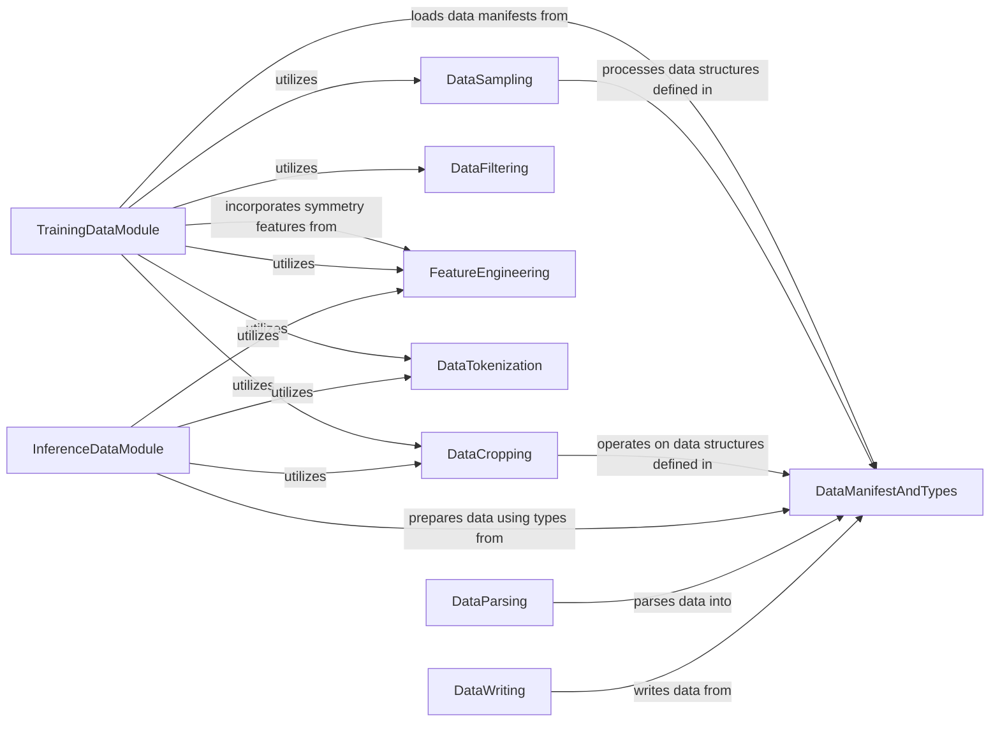

## Component Details

The Data Management & Augmentation component handles the loading, batching, sampling, and cropping of prepared data for training, validation, and inference. It incorporates various sampling strategies (cluster, random, distillation) and mechanisms to filter and augment data subsets, ensuring efficient processing for model training and inference.

### DataSampling
This component is responsible for implementing various sampling approaches for chains and interfaces from a dataset. It includes strategies like weighted sampling based on cluster IDs and molecular types (protein, nucleic acid, ligand), random sampling, and distillation sampling.

**Related Classes/Methods**:

- <a href="https://github.com/jwohlwend/boltz/blob/master/src/boltz/data/sample/cluster.py#L163-L283" target="_blank" rel="noopener noreferrer">`boltz.src.boltz.data.sample.cluster.ClusterSampler` (163:283)</a>
- <a href="https://github.com/jwohlwend/boltz/blob/master/src/boltz/data/sample/cluster.py#L108-L160" target="_blank" rel="noopener noreferrer">`boltz.src.boltz.data.sample.cluster.get_interface_weight` (108:160)</a>
- <a href="https://github.com/jwohlwend/boltz/blob/master/src/boltz/data/sample/cluster.py#L11-L27" target="_blank" rel="noopener noreferrer">`boltz.src.boltz.data.sample.cluster.get_chain_cluster` (11:27)</a>
- <a href="https://github.com/jwohlwend/boltz/blob/master/src/boltz/data/sample/cluster.py#L30-L55" target="_blank" rel="noopener noreferrer">`boltz.src.boltz.data.sample.cluster.get_interface_cluster` (30:55)</a>
- <a href="https://github.com/jwohlwend/boltz/blob/master/src/boltz/data/sample/cluster.py#L58-L105" target="_blank" rel="noopener noreferrer">`boltz.src.boltz.data.sample.cluster.get_chain_weight` (58:105)</a>
- <a href="https://github.com/jwohlwend/boltz/blob/master/src/boltz/data/sample/sampler.py#L29-L49" target="_blank" rel="noopener noreferrer">`boltz.src.boltz.data.sample.sampler.Sampler` (29:49)</a>
- <a href="https://github.com/jwohlwend/boltz/blob/master/src/boltz/data/sample/random.py#L10-L39" target="_blank" rel="noopener noreferrer">`boltz.src.boltz.data.sample.random.RandomSampler` (10:39)</a>
- <a href="https://github.com/jwohlwend/boltz/blob/master/src/boltz/data/sample/distillation.py#L9-L57" target="_blank" rel="noopener noreferrer">`boltz.src.boltz.data.sample.distillation.DistillationSampler` (9:57)</a>

### DataCropping
This component handles the selective extraction or 'cropping' of specific chain or interface tokens from data records, often involving random selection mechanisms. It includes specialized croppers like `BoltzCropper` and `AffinityCropper`.

**Related Classes/Methods**:

- <a href="https://github.com/jwohlwend/boltz/blob/master/src/boltz/data/crop/boltz.py#L127-L296" target="_blank" rel="noopener noreferrer">`boltz.src.boltz.data.crop.boltz.BoltzCropper` (127:296)</a>
- <a href="https://github.com/jwohlwend/boltz/blob/master/src/boltz/data/crop/boltz.py#L34-L65" target="_blank" rel="noopener noreferrer">`boltz.src.boltz.data.crop.boltz.pick_chain_token` (34:65)</a>
- <a href="https://github.com/jwohlwend/boltz/blob/master/src/boltz/data/crop/boltz.py#L68-L124" target="_blank" rel="noopener noreferrer">`boltz.src.boltz.data.crop.boltz.pick_interface_token` (68:124)</a>
- <a href="https://github.com/jwohlwend/boltz/blob/master/src/boltz/data/crop/boltz.py#L12-L31" target="_blank" rel="noopener noreferrer">`boltz.src.boltz.data.crop.boltz.pick_random_token` (12:31)</a>
- <a href="https://github.com/jwohlwend/boltz/blob/master/src/boltz/data/crop/cropper.py#L9-L45" target="_blank" rel="noopener noreferrer">`boltz.src.boltz.data.crop.cropper.Cropper` (9:45)</a>
- <a href="https://github.com/jwohlwend/boltz/blob/master/src/boltz/data/crop/affinity.py#L11-L164" target="_blank" rel="noopener noreferrer">`boltz.src.boltz.data.crop.affinity.AffinityCropper` (11:164)</a>

### DataFiltering
This component provides mechanisms to filter data based on specific criteria, such as identifying and excluding records with clashing polymer chains, or filtering based on date, max residues, resolution, size, or subsets.

**Related Classes/Methods**:

- <a href="https://github.com/jwohlwend/boltz/blob/master/src/boltz/data/filter/static/polymer.py#L175-L299" target="_blank" rel="noopener noreferrer">`boltz.src.boltz.data.filter.static.polymer.ClashingChainsFilter` (175:299)</a>
- <a href="https://github.com/jwohlwend/boltz/blob/master/src/boltz/data/filter/static/polymer.py#L166-L172" target="_blank" rel="noopener noreferrer">`boltz.src.boltz.data.filter.static.polymer.Clash` (166:172)</a>
- <a href="https://github.com/jwohlwend/boltz/blob/master/src/boltz/data/filter/static/filter.py#L8-L26" target="_blank" rel="noopener noreferrer">`boltz.src.boltz.data.filter.static.filter.StaticFilter` (8:26)</a>
- <a href="https://github.com/jwohlwend/boltz/blob/master/src/boltz/data/filter/dynamic/filter.py#L6-L24" target="_blank" rel="noopener noreferrer">`boltz.src.boltz.data.filter.dynamic.filter.DynamicFilter` (6:24)</a>
- <a href="https://github.com/jwohlwend/boltz/blob/master/src/boltz/data/filter/dynamic/date.py#L8-L76" target="_blank" rel="noopener noreferrer">`boltz.src.boltz.data.filter.dynamic.date.DateFilter` (8:76)</a>
- <a href="https://github.com/jwohlwend/boltz/blob/master/src/boltz/data/filter/dynamic/max_residues.py#L5-L37" target="_blank" rel="noopener noreferrer">`boltz.src.boltz.data.filter.dynamic.max_residues.MaxResiduesFilter` (5:37)</a>
- <a href="https://github.com/jwohlwend/boltz/blob/master/src/boltz/data/filter/dynamic/resolution.py#L5-L34" target="_blank" rel="noopener noreferrer">`boltz.src.boltz.data.filter.dynamic.resolution.ResolutionFilter` (5:34)</a>
- <a href="https://github.com/jwohlwend/boltz/blob/master/src/boltz/data/filter/dynamic/size.py#L5-L38" target="_blank" rel="noopener noreferrer">`boltz.src.boltz.data.filter.dynamic.size.SizeFilter` (5:38)</a>
- <a href="https://github.com/jwohlwend/boltz/blob/master/src/boltz/data/filter/dynamic/subset.py#L7-L42" target="_blank" rel="noopener noreferrer">`boltz.src.boltz.data.filter.dynamic.subset.SubsetFilter` (7:42)</a>
- <a href="https://github.com/jwohlwend/boltz/blob/master/src/boltz/data/filter/static/ligand.py#L8-L37" target="_blank" rel="noopener noreferrer">`boltz.src.boltz.data.filter.static.ligand.ExcludedLigands` (8:37)</a>
- <a href="https://github.com/jwohlwend/boltz/blob/master/src/boltz/data/filter/static/polymer.py#L104-L162" target="_blank" rel="noopener noreferrer">`boltz.src.boltz.data.filter.static.polymer.ConsecutiveCA` (104:162)</a>
- <a href="https://github.com/jwohlwend/boltz/blob/master/src/boltz/data/filter/static/polymer.py#L12-L62" target="_blank" rel="noopener noreferrer">`boltz.src.boltz.data.filter.static.polymer.MinimumLengthFilter` (12:62)</a>
- <a href="https://github.com/jwohlwend/boltz/blob/master/src/boltz/data/filter/static/polymer.py#L65-L101" target="_blank" rel="noopener noreferrer">`boltz.src.boltz.data.filter.static.polymer.UnknownFilter` (65:101)</a>

### DataManifestAndTypes
This component defines the fundamental data structures and types used throughout the `boltz` system, including the `Manifest` class for loading and managing dataset metadata, and other core data types like `Record`, `Structure`, and `MSA`.

**Related Classes/Methods**:

- <a href="https://github.com/jwohlwend/boltz/blob/master/src/boltz/data/types.py#L647-L683" target="_blank" rel="noopener noreferrer">`boltz.src.boltz.data.types.Manifest` (647:683)</a>
- <a href="https://github.com/jwohlwend/boltz/blob/master/src/boltz/data/types.py#L566-L576" target="_blank" rel="noopener noreferrer">`boltz.src.boltz.data.types.Record` (566:576)</a>
- <a href="https://github.com/jwohlwend/boltz/blob/master/src/boltz/data/types.py#L169-L319" target="_blank" rel="noopener noreferrer">`boltz.src.boltz.data.types.Structure` (169:319)</a>
- <a href="https://github.com/jwohlwend/boltz/blob/master/src/boltz/data/types.py#L469-L474" target="_blank" rel="noopener noreferrer">`boltz.src.boltz.data.types.MSA` (469:474)</a>
- <a href="https://github.com/jwohlwend/boltz/blob/master/src/boltz/data/types.py#L323-L441" target="_blank" rel="noopener noreferrer">`boltz.src.boltz.data.types.StructureV2` (323:441)</a>
- <a href="https://github.com/jwohlwend/boltz/blob/master/src/boltz/data/types.py#L483-L494" target="_blank" rel="noopener noreferrer">`boltz.src.boltz.data.types.StructureInfo` (483:494)</a>

### TrainingDataModule
This component orchestrates the entire data pipeline for model training, including loading manifests, applying feature transformations like symmetry, and preparing various datasets (training, validation) for consumption by a machine learning framework. It utilizes various data processing components like croppers, featurizers, filters, samplers, and tokenizers.

**Related Classes/Methods**:

- <a href="https://github.com/jwohlwend/boltz/blob/master/src/boltz/data/module/training.py#L491-L684" target="_blank" rel="noopener noreferrer">`boltz.src.boltz.data.module.training.BoltzTrainingDataModule` (491:684)</a>
- <a href="https://github.com/jwohlwend/boltz/blob/master/src/boltz/data/module/training.py#L71-L81" target="_blank" rel="noopener noreferrer">`boltz.src.boltz.data.module.training.Dataset` (71:81)</a>
- <a href="https://github.com/jwohlwend/boltz/blob/master/src/boltz/data/module/training.py#L186-L335" target="_blank" rel="noopener noreferrer">`boltz.src.boltz.data.module.training.TrainingDataset` (186:335)</a>
- <a href="https://github.com/jwohlwend/boltz/blob/master/src/boltz/data/module/training.py#L338-L488" target="_blank" rel="noopener noreferrer">`boltz.src.boltz.data.module.training.ValidationDataset` (338:488)</a>
- <a href="https://github.com/jwohlwend/boltz/blob/master/src/boltz/data/module/training.py#L36-L67" target="_blank" rel="noopener noreferrer">`boltz.src.boltz.data.module.training.DataConfig` (36:67)</a>
- <a href="https://github.com/jwohlwend/boltz/blob/master/src/boltz/data/module/trainingv2.py#L467-L660" target="_blank" rel="noopener noreferrer">`boltz.src.boltz.data.module.trainingv2.BoltzTrainingDataModule` (467:660)</a>
- <a href="https://github.com/jwohlwend/boltz/blob/master/src/boltz/data/module/trainingv2.py#L71-L81" target="_blank" rel="noopener noreferrer">`boltz.src.boltz.data.module.trainingv2.Dataset` (71:81)</a>
- <a href="https://github.com/jwohlwend/boltz/blob/master/src/boltz/data/module/trainingv2.py#L168-L314" target="_blank" rel="noopener noreferrer">`boltz.src.boltz.data.module.trainingv2.TrainingDataset` (168:314)</a>
- <a href="https://github.com/jwohlwend/boltz/blob/master/src/boltz/data/module/trainingv2.py#L317-L464" target="_blank" rel="noopener noreferrer">`boltz.src.boltz.data.module.trainingv2.ValidationDataset` (317:464)</a>
- <a href="https://github.com/jwohlwend/boltz/blob/master/src/boltz/data/module/trainingv2.py#L36-L67" target="_blank" rel="noopener noreferrer">`boltz.src.boltz.data.module.trainingv2.DataConfig` (36:67)</a>

### InferenceDataModule
This component is dedicated to preparing data specifically for model inference, providing prediction datasets and dataloaders. It leverages featurizers and tokenizers to process data for inference.

**Related Classes/Methods**:

- <a href="https://github.com/jwohlwend/boltz/blob/master/src/boltz/data/module/inference.py#L223-L307" target="_blank" rel="noopener noreferrer">`boltz.src.boltz.data.module.inference.BoltzInferenceDataModule` (223:307)</a>
- <a href="https://github.com/jwohlwend/boltz/blob/master/src/boltz/data/module/inference.py#L121-L220" target="_blank" rel="noopener noreferrer">`boltz.src.boltz.data.module.inference.PredictionDataset` (121:220)</a>
- <a href="https://github.com/jwohlwend/boltz/blob/master/src/boltz/data/module/inference.py#L249-L271" target="_blank" rel="noopener noreferrer">`boltz.src.boltz.data.module.inference.BoltzInferenceDataModule:predict_dataloader` (249:271)</a>
- <a href="https://github.com/jwohlwend/boltz/blob/master/src/boltz/data/module/inferencev2.py#L313-L429" target="_blank" rel="noopener noreferrer">`boltz.src.boltz.data.module.inferencev2.Boltz2InferenceDataModule` (313:429)</a>
- <a href="https://github.com/jwohlwend/boltz/blob/master/src/boltz/data/module/inferencev2.py#L157-L310" target="_blank" rel="noopener noreferrer">`boltz.src.boltz.data.module.inferencev2.PredictionDataset` (157:310)</a>

### FeatureEngineering
This component is responsible for generating and converting various features from atomic and molecular data, including symmetry-related features, which are crucial for downstream tasks like model training and inference. It includes different featurizer implementations.

**Related Classes/Methods**:

- <a href="https://github.com/jwohlwend/boltz/blob/master/src/boltz/data/feature/symmetry.py#L35-L67" target="_blank" rel="noopener noreferrer">`boltz.src.boltz.data.feature.symmetry.get_symmetries` (35:67)</a>
- <a href="https://github.com/jwohlwend/boltz/blob/master/src/boltz/data/feature/symmetry.py#L15-L32" target="_blank" rel="noopener noreferrer">`boltz.src.boltz.data.feature.symmetry.convert_atom_name` (15:32)</a>
- `boltz.src.boltz.data.feature.featurizer.BoltzFeaturizer` (full file reference)
- `boltz.src.boltz.data.feature.featurizerv2.Boltz2Featurizer` (full file reference)

### DataTokenization
This component handles the tokenization of data, converting raw data into a format suitable for model input. It includes different tokenizer implementations like `BoltzTokenizer` and `Boltz2Tokenizer`.

**Related Classes/Methods**:

- <a href="https://github.com/jwohlwend/boltz/blob/master/src/boltz/data/tokenize/boltz.py#L32-L195" target="_blank" rel="noopener noreferrer">`boltz.src.boltz.data.tokenize.boltz.BoltzTokenizer` (32:195)</a>
- <a href="https://github.com/jwohlwend/boltz/blob/master/src/boltz/data/tokenize/boltz2.py#L349-L396" target="_blank" rel="noopener noreferrer">`boltz.src.boltz.data.tokenize.boltz2.Boltz2Tokenizer` (349:396)</a>
- <a href="https://github.com/jwohlwend/boltz/blob/master/src/boltz/data/tokenize/tokenizer.py#L6-L24" target="_blank" rel="noopener noreferrer">`boltz.src.boltz.data.tokenize.tokenizer.Tokenizer` (6:24)</a>

### DataParsing
This component is responsible for parsing various data formats, such as A3M, CSV, FASTA, MMCIF, and YAML, into the internal data structures used by the `boltz` system.

**Related Classes/Methods**:

- `boltz.src.boltz.data.parse.a3m` (full file reference)
- `boltz.src.boltz.data.parse.csv` (full file reference)
- `boltz.src.boltz.data.parse.fasta` (full file reference)
- `boltz.src.boltz.data.parse.mmcif` (full file reference)
- `boltz.src.boltz.data.parse.mmcif_with_constraints` (full file reference)
- `boltz.src.boltz.data.parse.schema` (full file reference)
- `boltz.src.boltz.data.parse.yaml` (full file reference)

### DataWriting
This component provides functionalities for writing processed data into various output formats, such as MMCIF and PDB.

**Related Classes/Methods**:

- `boltz.src.boltz.data.write.mmcif` (full file reference)
- `boltz.src.boltz.data.write.pdb` (full file reference)
- `boltz.src.boltz.data.write.writer.Writer` (full file reference)

### [FAQ](https://github.com/CodeBoarding/GeneratedOnBoardings/tree/main?tab=readme-ov-file#faq)