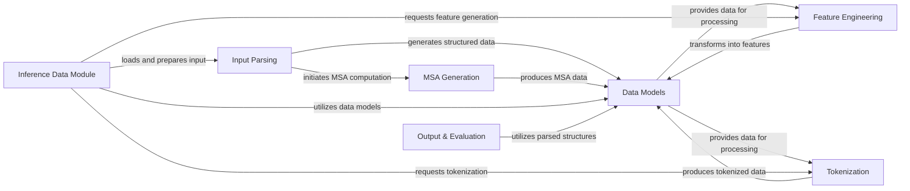

## Component Details

The "Data Processing & Feature Engineering" subsystem is responsible for transforming raw biological input data from various formats into structured, featurized, and tokenized representations suitable for machine learning models. It encompasses the initial parsing of diverse data types, generation of multiple sequence alignments, definition of core data structures, extraction of numerical features, and conversion into tokenized sequences, culminating in data preparation for model inference and subsequent output handling.

### Input Parsing
Manages the parsing of raw input data from various formats (MMCIF, FASTA, YAML, CSV, A3M) into internal data structures. This component is responsible for the initial ingestion and structuring of diverse biological data, including the extraction of detailed structural information and computation of geometric and chemical constraints.

**Related Classes/Methods**:

- <a href="https://github.com/jwohlwend/boltz/blob/master/src/boltz/main.py#L477-L605" target="_blank" rel="noopener noreferrer">`boltz.src.boltz.main:process_input` (477:605)</a>
- <a href="https://github.com/jwohlwend/boltz/blob/master/src/boltz/main.py#L404-L474" target="_blank" rel="noopener noreferrer">`boltz.src.boltz.main:compute_msa` (404:474)</a>
- <a href="https://github.com/jwohlwend/boltz/blob/master/src/boltz/data/parse/fasta.py#L11-L138" target="_blank" rel="noopener noreferrer">`boltz.src.boltz.data.parse.fasta:parse_fasta` (11:138)</a>
- <a href="https://github.com/jwohlwend/boltz/blob/master/src/boltz/data/parse/yaml.py#L10-L68" target="_blank" rel="noopener noreferrer">`boltz.src.boltz.data.parse.yaml:parse_yaml` (10:68)</a>
- <a href="https://github.com/jwohlwend/boltz/blob/master/src/boltz/data/parse/a3m.py#L104-L134" target="_blank" rel="noopener noreferrer">`boltz.src.boltz.data.parse.a3m:parse_a3m` (104:134)</a>
- <a href="https://github.com/jwohlwend/boltz/blob/master/src/boltz/data/parse/csv.py#L11-L100" target="_blank" rel="noopener noreferrer">`boltz.src.boltz.data.parse.csv:parse_csv` (11:100)</a>
- <a href="https://github.com/jwohlwend/boltz/blob/master/src/boltz/data/parse/mmcif_with_constraints.py#L200-L300" target="_blank" rel="noopener noreferrer">`boltz.src.boltz.data.parse.mmcif_with_constraints:parse_mmcif` (200:300)</a>
- `boltz.src.boltz.data.parse.mmcif_with_constraints:compute_geometry_constraints` (full file reference)
- `boltz.src.boltz.data.parse.mmcif_with_constraints:compute_chiral_atom_constraints` (full file reference)
- `boltz.src.boltz.data.parse.mmcif_with_constraints:compute_stereo_bond_constraints` (full file reference)
- `boltz.src.boltz.data.parse.mmcif_with_constraints:compute_flatness_constraints` (full file reference)
- `boltz.src.boltz.data.parse.mmcif_with_constraints.ParsedRDKitBoundsConstraint` (full file reference)
- `boltz.src.boltz.data.parse.mmcif_with_constraints.ParsedChiralAtomConstraint` (full file reference)
- `boltz.src.boltz.data.parse.mmcif_with_constraints.ParsedStereoBondConstraint` (full file reference)
- `boltz.src.boltz.data.parse.mmcif_with_constraints.ParsedPlanarBondConstraint` (full file reference)
- `boltz.src.boltz.data.parse.mmcif_with_constraints.ParsedPlanarRing5Constraint` (full file reference)
- `boltz.src.boltz.data.parse.mmcif_with_constraints.ParsedPlanarRing6Constraint` (full file reference)
- `boltz.src.boltz.data.parse.mmcif_with_constraints.ParsedAtom` (full file reference)
- `boltz.src.boltz.data.parse.mmcif_with_constraints.ParsedResidue` (full file reference)
- `boltz.src.boltz.data.parse.mmcif_with_constraints.ParsedBond` (full file reference)
- `boltz.src.boltz.data.parse.mmcif_with_constraints.ParsedChain` (full file reference)
- `boltz.src.boltz.data.parse.mmcif_with_constraints.get_mol` (full file reference)
- `boltz.src.boltz.data.parse.mmcif_with_constraints.get_dates` (full file reference)
- `boltz.src.boltz.data.parse.mmcif_with_constraints.get_resolution` (full file reference)
- `boltz.src.boltz.data.parse.mmcif_with_constraints.get_method` (full file reference)
- `boltz.src.boltz.data.parse.mmcif_with_constraints.get_experiment_conditions` (full file reference)
- `boltz.src.boltz.data.parse.mmcif_with_constraints.compute_covalent_ligands` (full file reference)
- `boltz.src.boltz.data.parse.mmcif_with_constraints.parse_connection` (full file reference)
- `boltz.src.boltz.data.parse.mmcif_with_constraints.compute_interfaces` (full file reference)
- `boltz.src.boltz.data.parse.mmcif_with_constraints.ParsedStructure` (full file reference)
- <a href="https://github.com/jwohlwend/boltz/blob/master/src/boltz/data/parse/schema.py#L932-L1000" target="_blank" rel="noopener noreferrer">`boltz.src.boltz.data.parse.schema:parse_boltz_schema` (932:1000)</a>
- <a href="https://github.com/jwohlwend/boltz/blob/master/src/boltz/data/parse/schema.py#L788-L916" target="_blank" rel="noopener noreferrer">`boltz.src.boltz.data.parse.schema.parse_polymer` (788:916)</a>
- <a href="https://github.com/jwohlwend/boltz/blob/master/src/boltz/data/parse/schema.py#L635-L785" target="_blank" rel="noopener noreferrer">`boltz.src.boltz.data.parse.schema.parse_ccd_residue` (635:785)</a>
- <a href="https://github.com/jwohlwend/boltz/blob/master/src/boltz/data/parse/schema.py#L151-L160" target="_blank" rel="noopener noreferrer">`boltz.src.boltz.data.parse.schema.ParsedChain` (151:160)</a>
- `boltz.src.boltz.data.parse.schema.standardize` (full file reference)
- <a href="https://github.com/jwohlwend/boltz/blob/master/src/boltz/data/parse/schema.py#L198-L252" target="_blank" rel="noopener noreferrer">`boltz.src.boltz.data.parse.schema.compute_3d_conformer` (198:252)</a>
- `boltz.data.parse.mmcif.parse_mmcif` (full file reference)
- <a href="https://github.com/jwohlwend/boltz/blob/master/src/boltz/data/parse/schema.py#L588-L615" target="_blank" rel="noopener noreferrer">`boltz.src.boltz.data.parse.schema.get_template_records_from_matching` (588:615)</a>
- <a href="https://github.com/jwohlwend/boltz/blob/master/src/boltz/data/parse/schema.py#L541-L585" target="_blank" rel="noopener noreferrer">`boltz.src.boltz.data.parse.schema.get_template_records_from_search` (541:585)</a>
- <a href="https://github.com/jwohlwend/boltz/blob/master/src/boltz/data/parse/schema.py#L178-L195" target="_blank" rel="noopener noreferrer">`boltz.src.boltz.data.parse.schema.convert_atom_name` (178:195)</a>

### MSA Generation
Manages the execution and retrieval of Multiple Sequence Alignments using MMseqs2, a critical step for providing evolutionary context to protein structures.

**Related Classes/Methods**:

- <a href="https://github.com/jwohlwend/boltz/blob/master/src/boltz/data/msa/mmseqs2.py#L20-L254" target="_blank" rel="noopener noreferrer">`boltz.src.boltz.data.msa.mmseqs2:run_mmseqs2` (20:254)</a>
- <a href="https://github.com/jwohlwend/boltz/blob/master/src/boltz/data/msa/mmseqs2.py#L35-L72" target="_blank" rel="noopener noreferrer">`boltz.src.boltz.data.msa.mmseqs2.run_mmseqs2.submit` (35:72)</a>
- <a href="https://github.com/jwohlwend/boltz/blob/master/src/boltz/data/msa/mmseqs2.py#L74-L102" target="_blank" rel="noopener noreferrer">`boltz.src.boltz.data.msa.mmseqs2.run_mmseqs2.status` (74:102)</a>
- <a href="https://github.com/jwohlwend/boltz/blob/master/src/boltz/data/msa/mmseqs2.py#L104-L128" target="_blank" rel="noopener noreferrer">`boltz.src.boltz.data.msa.mmseqs2.run_mmseqs2.download` (104:128)</a>

### Data Models
Defines the core data structures and types used across the Boltz system, representing biological entities like structures, MSAs, and various associated information and constraints. It acts as the central repository for structured data.

**Related Classes/Methods**:

- <a href="https://github.com/jwohlwend/boltz/blob/master/src/boltz/data/types.py#L169-L319" target="_blank" rel="noopener noreferrer">`boltz.src.boltz.data.types.Structure` (169:319)</a>
- <a href="https://github.com/jwohlwend/boltz/blob/master/src/boltz/data/types.py#L181-L204" target="_blank" rel="noopener noreferrer">`boltz.src.boltz.data.types.Structure:load` (181:204)</a>
- <a href="https://github.com/jwohlwend/boltz/blob/master/src/boltz/data/types.py#L206-L319" target="_blank" rel="noopener noreferrer">`boltz.src.boltz.data.types.Structure:remove_invalid_chains` (206:319)</a>
- <a href="https://github.com/jwohlwend/boltz/blob/master/src/boltz/data/types.py#L323-L441" target="_blank" rel="noopener noreferrer">`boltz.data.types.StructureV2` (323:441)</a>
- <a href="https://github.com/jwohlwend/boltz/blob/master/src/boltz/data/types.py#L765-L777" target="_blank" rel="noopener noreferrer">`boltz.data.types.Tokenized` (765:777)</a>
- <a href="https://github.com/jwohlwend/boltz/blob/master/src/boltz/data/types.py#L469-L474" target="_blank" rel="noopener noreferrer">`boltz.data.types.MSA` (469:474)</a>
- <a href="https://github.com/jwohlwend/boltz/blob/master/src/boltz/data/types.py#L618-L626" target="_blank" rel="noopener noreferrer">`boltz.data.types.ResidueConstraints` (618:626)</a>
- <a href="https://github.com/jwohlwend/boltz/blob/master/src/boltz/data/types.py#L483-L494" target="_blank" rel="noopener noreferrer">`boltz.data.types.StructureInfo` (483:494)</a>
- <a href="https://github.com/jwohlwend/boltz/blob/master/src/boltz/data/types.py#L558-L562" target="_blank" rel="noopener noreferrer">`boltz.data.types.AffinityInfo` (558:562)</a>
- <a href="https://github.com/jwohlwend/boltz/blob/master/src/boltz/data/types.py#L498-L508" target="_blank" rel="noopener noreferrer">`boltz.data.types.ChainInfo` (498:508)</a>
- <a href="https://github.com/jwohlwend/boltz/blob/master/src/boltz/data/types.py#L521-L524" target="_blank" rel="noopener noreferrer">`boltz.data.types.InferenceOptions` (521:524)</a>
- <a href="https://github.com/jwohlwend/boltz/blob/master/src/boltz/data/types.py#L566-L576" target="_blank" rel="noopener noreferrer">`boltz.data.types.Record` (566:576)</a>
- <a href="https://github.com/jwohlwend/boltz/blob/master/src/boltz/data/types.py#L635-L643" target="_blank" rel="noopener noreferrer">`boltz.data.types.Target` (635:643)</a>
- <a href="https://github.com/jwohlwend/boltz/blob/master/src/boltz/data/tokenize/boltz.py#L11-L29" target="_blank" rel="noopener noreferrer">`boltz.src.boltz.data.tokenize.boltz.TokenData` (11:29)</a>
- <a href="https://github.com/jwohlwend/boltz/blob/master/src/boltz/data/tokenize/boltz2.py#L19-L43" target="_blank" rel="noopener noreferrer">`boltz.src.boltz.data.tokenize.boltz2.TokenData` (19:43)</a>

### Feature Engineering
Transforms raw biological data and parsed structures into numerical features for machine learning models, handling different versions of featurization logic including token, atom, MSA, template, and symmetry features.

**Related Classes/Methods**:

- <a href="https://github.com/jwohlwend/boltz/blob/master/src/boltz/data/feature/featurizer.py#L100-L200" target="_blank" rel="noopener noreferrer">`boltz.src.boltz.data.feature.featurizer.BoltzFeaturizer:process` (100:200)</a>
- `boltz.src.boltz.data.feature.featurizerv2.Boltz2Featurizer:process` (full file reference)
- <a href="https://github.com/jwohlwend/boltz/blob/master/src/boltz/data/feature/featurizer.py#L488-L670" target="_blank" rel="noopener noreferrer">`boltz.src.boltz.data.feature.featurizer.process_token_features` (488:670)</a>
- <a href="https://github.com/jwohlwend/boltz/blob/master/src/boltz/data/feature/featurizer.py#L673-L896" target="_blank" rel="noopener noreferrer">`boltz.src.boltz.data.feature.featurizer.process_atom_features` (673:896)</a>
- <a href="https://github.com/jwohlwend/boltz/blob/master/src/boltz/data/feature/featurizer.py#L899-L971" target="_blank" rel="noopener noreferrer">`boltz.src.boltz.data.feature.featurizer.process_msa_features` (899:971)</a>
- <a href="https://github.com/jwohlwend/boltz/blob/master/src/boltz/data/feature/featurizer.py#L974-L994" target="_blank" rel="noopener noreferrer">`boltz.src.boltz.data.feature.featurizer.process_symmetry_features` (974:994)</a>
- <a href="https://github.com/jwohlwend/boltz/blob/master/src/boltz/data/feature/featurizer.py#L997-L1000" target="_blank" rel="noopener noreferrer">`boltz.src.boltz.data.feature.featurizer.process_residue_constraint_features` (997:1000)</a>
- `boltz.src.boltz.data.feature.featurizer.process_chain_feature_constraints` (full file reference)
- `boltz.src.boltz.data.feature.featurizerv2.process_ensemble_features` (full file reference)
- `boltz.src.boltz.data.feature.featurizerv2.process_template_features` (full file reference)
- `boltz.src.boltz.data.feature.featurizerv2.load_dummy_templates_features` (full file reference)
- <a href="https://github.com/jwohlwend/boltz/blob/master/src/boltz/data/mol.py#L84-L193" target="_blank" rel="noopener noreferrer">`boltz.data.mol.get_symmetries` (84:193)</a>

### Tokenization
Converts processed biological data into a tokenized format, essential for sequence-based model inputs, by mapping structural and sequence information to discrete tokens.

**Related Classes/Methods**:

- <a href="https://github.com/jwohlwend/boltz/blob/master/src/boltz/data/tokenize/boltz.py#L35-L195" target="_blank" rel="noopener noreferrer">`boltz.src.boltz.data.tokenize.boltz.BoltzTokenizer:tokenize` (35:195)</a>
- <a href="https://github.com/jwohlwend/boltz/blob/master/src/boltz/data/tokenize/boltz2.py#L349-L396" target="_blank" rel="noopener noreferrer">`boltz.src.boltz.data.tokenize.boltz2.Boltz2Tokenizer` (349:396)</a>
- <a href="https://github.com/jwohlwend/boltz/blob/master/src/boltz/data/tokenize/boltz2.py#L352-L396" target="_blank" rel="noopener noreferrer">`boltz.src.boltz.data.tokenize.boltz2.Boltz2Tokenizer:tokenize` (352:396)</a>
- <a href="https://github.com/jwohlwend/boltz/blob/master/src/boltz/data/tokenize/boltz2.py#L104-L346" target="_blank" rel="noopener noreferrer">`boltz.src.boltz.data.tokenize.boltz2:tokenize_structure` (104:346)</a>
- <a href="https://github.com/jwohlwend/boltz/blob/master/src/boltz/data/tokenize/boltz2.py#L46-L76" target="_blank" rel="noopener noreferrer">`boltz.src.boltz.data.tokenize.boltz2.compute_frame` (46:76)</a>
- <a href="https://github.com/jwohlwend/boltz/blob/master/src/boltz/data/tokenize/boltz2.py#L79-L101" target="_blank" rel="noopener noreferrer">`boltz.src.boltz.data.tokenize.boltz2.get_unk_token` (79:101)</a>

### Inference Data Module
Prepares and manages datasets and dataloaders specifically for model inference, integrating data loading, tokenization, and featurization to provide a streamlined data pipeline for models.

**Related Classes/Methods**:

- <a href="https://github.com/jwohlwend/boltz/blob/master/src/boltz/data/module/inference.py#L151-L209" target="_blank" rel="noopener noreferrer">`boltz.src.boltz.data.module.inference.PredictionDataset:__getitem__` (151:209)</a>
- <a href="https://github.com/jwohlwend/boltz/blob/master/src/boltz/data/module/inference.py#L249-L271" target="_blank" rel="noopener noreferrer">`boltz.src.boltz.data.module.inference.BoltzInferenceDataModule:predict_dataloader` (249:271)</a>
- <a href="https://github.com/jwohlwend/boltz/blob/master/src/boltz/data/module/inferencev2.py#L160-L204" target="_blank" rel="noopener noreferrer">`boltz.src.boltz.data.module.inferencev2.PredictionDataset:__init__` (160:204)</a>
- <a href="https://github.com/jwohlwend/boltz/blob/master/src/boltz/data/module/inferencev2.py#L206-L299" target="_blank" rel="noopener noreferrer">`boltz.src.boltz.data.module.inferencev2.PredictionDataset:__getitem__` (206:299)</a>
- <a href="https://github.com/jwohlwend/boltz/blob/master/src/boltz/data/module/inference.py#L25-L74" target="_blank" rel="noopener noreferrer">`boltz.src.boltz.data.module.inference.load_input` (25:74)</a>
- <a href="https://github.com/jwohlwend/boltz/blob/master/src/boltz/data/module/inferencev2.py#L27-L109" target="_blank" rel="noopener noreferrer">`boltz.src.boltz.data.module.inferencev2.load_input` (27:109)</a>
- <a href="https://github.com/jwohlwend/boltz/blob/master/src/boltz/data/module/training.py#L84-L140" target="_blank" rel="noopener noreferrer">`boltz.src.boltz.data.module.training:load_input` (84:140)</a>

### Output & Evaluation
Handles the writing of results in various formats (e.g., MMCIF, PDB) and provides functions for evaluating physical simulation metrics, ensuring that model outputs can be stored and assessed.

**Related Classes/Methods**:

- <a href="https://github.com/jwohlwend/boltz/blob/master/src/boltz/data/write/writer.py#L47-L245" target="_blank" rel="noopener noreferrer">`boltz.src.boltz.data.write.writer.BoltzWriter:write_on_batch_end` (47:245)</a>
- <a href="https://github.com/jwohlwend/boltz/blob/master/scripts/eval/physcialsim_metrics.py#L210-L238" target="_blank" rel="noopener noreferrer">`boltz.scripts.eval.physcialsim_metrics:process_fn` (210:238)</a>
- `boltz.data.write.mmcif` (full file reference)
- `boltz.data.write.pdb` (full file reference)

### [FAQ](https://github.com/CodeBoarding/GeneratedOnBoardings/tree/main?tab=readme-ov-file#faq)