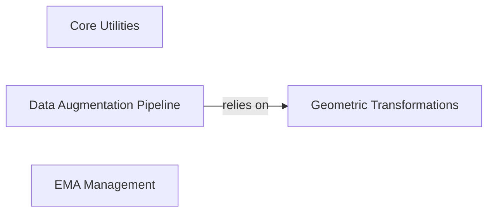

## Component Details

This graph outlines the key components within the `boltz.src.boltz.model.modules.utils` module, focusing on their structure, functionality, and interdependencies. The module provides a range of utility functions, from basic existence checks and default value assignments to complex geometric transformations and data augmentation pipelines, all crucial for the project's machine learning models. The main flow involves preparing and transforming data, managing model parameters, and applying various mathematical operations.

### Core Utilities
Provides fundamental utility functions like existence checks, default value assignment, logarithmic operations, and a specialized activation function (SwiGLU). It also includes a linear layer without bias.

**Related Classes/Methods**:

- <a href="https://github.com/jwohlwend/boltz/blob/master/src/boltz/model/modules/utils.py#L14-L14" target="_blank" rel="noopener noreferrer">`boltz.src.boltz.model.modules.utils:LinearNoBias` (14:14)</a>
- <a href="https://github.com/jwohlwend/boltz/blob/master/src/boltz/model/modules/utils.py#L17-L18" target="_blank" rel="noopener noreferrer">`boltz.src.boltz.model.modules.utils:exists` (17:18)</a>
- <a href="https://github.com/jwohlwend/boltz/blob/master/src/boltz/model/modules/utils.py#L21-L22" target="_blank" rel="noopener noreferrer">`boltz.src.boltz.model.modules.utils:default` (21:22)</a>
- <a href="https://github.com/jwohlwend/boltz/blob/master/src/boltz/model/modules/utils.py#L25-L26" target="_blank" rel="noopener noreferrer">`boltz.src.boltz.model.modules.utils:log` (25:26)</a>
- <a href="https://github.com/jwohlwend/boltz/blob/master/src/boltz/model/modules/utils.py#L29-L35" target="_blank" rel="noopener noreferrer">`boltz.src.boltz.model.modules.utils:SwiGLU` (29:35)</a>

### Geometric Transformations
Handles all aspects of 3D geometric transformations, including quaternion manipulation, conversion to rotation matrices, generation of random quaternions and rotation matrices, and basic coordinate centering.

**Related Classes/Methods**:

- <a href="https://github.com/jwohlwend/boltz/blob/master/src/boltz/model/modules/utils.py#L213-L228" target="_blank" rel="noopener noreferrer">`boltz.src.boltz.model.modules.utils:_copysign` (213:228)</a>
- <a href="https://github.com/jwohlwend/boltz/blob/master/src/boltz/model/modules/utils.py#L231-L260" target="_blank" rel="noopener noreferrer">`boltz.src.boltz.model.modules.utils:quaternion_to_matrix` (231:260)</a>
- <a href="https://github.com/jwohlwend/boltz/blob/master/src/boltz/model/modules/utils.py#L263-L284" target="_blank" rel="noopener noreferrer">`boltz.src.boltz.model.modules.utils:random_quaternions` (263:284)</a>
- <a href="https://github.com/jwohlwend/boltz/blob/master/src/boltz/model/modules/utils.py#L287-L303" target="_blank" rel="noopener noreferrer">`boltz.src.boltz.model.modules.utils:random_rotations` (287:303)</a>
- <a href="https://github.com/jwohlwend/boltz/blob/master/src/boltz/model/modules/utils.py#L38-L43" target="_blank" rel="noopener noreferrer">`boltz.src.boltz.model.modules.utils:center` (38:43)</a>

### Data Augmentation Pipeline
Orchestrates the application of random augmentations (rotations and translations) and centering to input coordinate data, often used in machine learning pipelines for data variability.

**Related Classes/Methods**:

- <a href="https://github.com/jwohlwend/boltz/blob/master/src/boltz/model/modules/utils.py#L46-L53" target="_blank" rel="noopener noreferrer">`boltz.src.boltz.model.modules.utils:compute_random_augmentation` (46:53)</a>
- <a href="https://github.com/jwohlwend/boltz/blob/master/src/boltz/model/modules/utils.py#L56-L64" target="_blank" rel="noopener noreferrer">`boltz.src.boltz.model.modules.utils:randomly_rotate` (56:64)</a>
- <a href="https://github.com/jwohlwend/boltz/blob/master/src/boltz/model/modules/utils.py#L67-L100" target="_blank" rel="noopener noreferrer">`boltz.src.boltz.model.modules.utils:center_random_augmentation` (67:100)</a>

### EMA Management
Manages the exponential moving average of model parameters, providing functionalities to update, store, restore, and copy parameters for stable training and evaluation.

**Related Classes/Methods**:

- <a href="https://github.com/jwohlwend/boltz/blob/master/src/boltz/model/modules/utils.py#L103-L207" target="_blank" rel="noopener noreferrer">`boltz.src.boltz.model.modules.utils:ExponentialMovingAverage` (103:207)</a>

### [FAQ](https://github.com/CodeBoarding/GeneratedOnBoardings/tree/main?tab=readme-ov-file#faq)