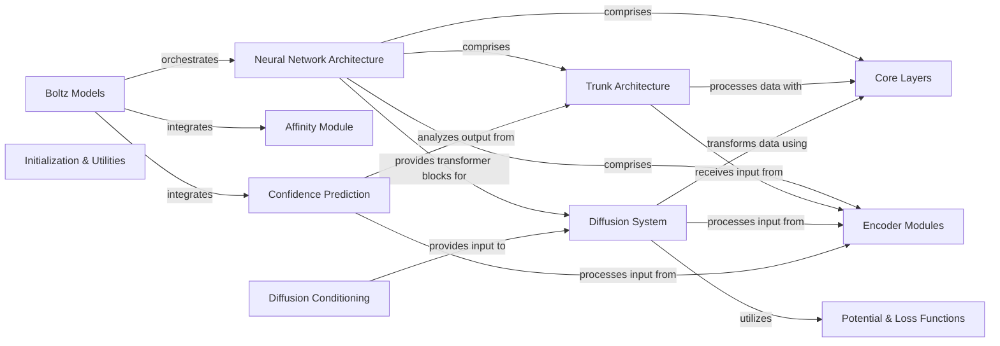

## Component Details

This architectural overview details the core components of the Boltz system, designed for protein structure prediction and diffusion. It highlights the main Boltz models as orchestrators, the foundational Neural Network Architecture providing core computational blocks, and specialized modules for diffusion, confidence prediction, and feature encoding. The graph illustrates the flow of data and dependencies among these components, showcasing how fundamental layers and utilities support the complex tasks of molecular modeling.

### Boltz Models
These are the main entry points of the Boltz system, orchestrating the entire protein structure prediction or diffusion process. They integrate various sub-modules like embedding, MSA processing, pairformer blocks, diffusion models, and confidence prediction. Boltz1 and Boltz2 represent different versions or configurations of the overall model.

**Related Classes/Methods**:

- `boltz.src.boltz.model.models.boltz1.Boltz1` (full file reference)
- `boltz.src.boltz.model.models.boltz2.Boltz2` (full file reference)

### Diffusion System
This component is responsible for the diffusion-based generation or refinement of molecular structures. It typically involves a DiffusionModule that processes input features and a DiffusionTransformer that applies a series of transformations to refine the diffused coordinates. AtomDiffusion acts as the main interface for the diffusion process, handling sampling and forward passes.

**Related Classes/Methods**:

- <a href="https://github.com/jwohlwend/boltz/blob/master/src/boltz/model/modules/diffusion.py#L41-L229" target="_blank" rel="noopener noreferrer">`boltz.src.boltz.model.modules.diffusion.DiffusionModule` (41:229)</a>
- <a href="https://github.com/jwohlwend/boltz/blob/master/src/boltz/model/modules/diffusion.py#L284-L844" target="_blank" rel="noopener noreferrer">`boltz.src.boltz.model.modules.diffusion.AtomDiffusion` (284:844)</a>
- <a href="https://github.com/jwohlwend/boltz/blob/master/src/boltz/model/modules/diffusionv2.py#L38-L176" target="_blank" rel="noopener noreferrer">`boltz.src.boltz.model.modules.diffusionv2.DiffusionModule` (38:176)</a>
- <a href="https://github.com/jwohlwend/boltz/blob/master/src/boltz/model/modules/diffusionv2.py#L179-L677" target="_blank" rel="noopener noreferrer">`boltz.src.boltz.model.modules.diffusionv2.AtomDiffusion` (179:677)</a>
- <a href="https://github.com/jwohlwend/boltz/blob/master/src/boltz/model/modules/transformers.py#L90-L177" target="_blank" rel="noopener noreferrer">`boltz.src.boltz.model.modules.transformers.DiffusionTransformer` (90:177)</a>
- <a href="https://github.com/jwohlwend/boltz/blob/master/src/boltz/model/modules/transformersv2.py#L68-L137" target="_blank" rel="noopener noreferrer">`boltz.src.boltz.model.modules.transformersv2.DiffusionTransformer` (68:137)</a>

### Confidence Prediction
This module assesses the quality and confidence of the predicted protein structures. It takes features from the main model and outputs metrics like pLDDT, pTM, and iPTM, which indicate the accuracy of the predicted coordinates and interfaces.

**Related Classes/Methods**:

- <a href="https://github.com/jwohlwend/boltz/blob/master/src/boltz/model/modules/confidence.py#L20-L334" target="_blank" rel="noopener noreferrer">`boltz.src.boltz.model.modules.confidence.ConfidenceModule` (20:334)</a>
- <a href="https://github.com/jwohlwend/boltz/blob/master/src/boltz/model/modules/confidence.py#L337-L481" target="_blank" rel="noopener noreferrer">`boltz.src.boltz.model.modules.confidence.ConfidenceHeads` (337:481)</a>
- <a href="https://github.com/jwohlwend/boltz/blob/master/src/boltz/model/modules/confidencev2.py#L19-L237" target="_blank" rel="noopener noreferrer">`boltz.src.boltz.model.modules.confidencev2.ConfidenceModule` (19:237)</a>

### Trunk Architecture
This forms the core of the feature processing pipeline, handling the main transformations of sequence and pair representations. It includes modules for embedding initial inputs, processing Multiple Sequence Alignments (MSA), and applying pair-wise transformations through Pairformer blocks. It also includes modules for distogram, B-factor, and contact conditioning.

**Related Classes/Methods**:

- <a href="https://github.com/jwohlwend/boltz/blob/master/src/boltz/model/modules/trunk.py#L24-L113" target="_blank" rel="noopener noreferrer">`boltz.src.boltz.model.modules.trunk.InputEmbedder` (24:113)</a>
- <a href="https://github.com/jwohlwend/boltz/blob/master/src/boltz/model/modules/trunk.py#L116-L289" target="_blank" rel="noopener noreferrer">`boltz.src.boltz.model.modules.trunk.MSAModule` (116:289)</a>
- <a href="https://github.com/jwohlwend/boltz/blob/master/src/boltz/model/modules/trunk.py#L424-L549" target="_blank" rel="noopener noreferrer">`boltz.src.boltz.model.modules.trunk.PairformerModule` (424:549)</a>
- <a href="https://github.com/jwohlwend/boltz/blob/master/src/boltz/model/modules/trunkv2.py#L68-L208" target="_blank" rel="noopener noreferrer">`boltz.src.boltz.model.modules.trunkv2.InputEmbedder` (68:208)</a>
- <a href="https://github.com/jwohlwend/boltz/blob/master/src/boltz/model/modules/trunkv2.py#L512-L669" target="_blank" rel="noopener noreferrer">`boltz.src.boltz.model.modules.trunkv2.MSAModule` (512:669)</a>
- <a href="https://github.com/jwohlwend/boltz/blob/master/src/boltz/model/modules/trunkv2.py#L21-L65" target="_blank" rel="noopener noreferrer">`boltz.src.boltz.model.modules.trunkv2.ContactConditioning` (21:65)</a>
- <a href="https://github.com/jwohlwend/boltz/blob/master/src/boltz/model/modules/trunkv2.py#L361-L509" target="_blank" rel="noopener noreferrer">`boltz.src.boltz.model.modules.trunkv2.TemplateV2Module` (361:509)</a>
- <a href="https://github.com/jwohlwend/boltz/blob/master/src/boltz/model/modules/trunkv2.py#L211-L358" target="_blank" rel="noopener noreferrer">`boltz.src.boltz.model.modules.trunkv2.TemplateModule` (211:358)</a>
- <a href="https://github.com/jwohlwend/boltz/blob/master/src/boltz/model/modules/trunkv2.py#L794-L828" target="_blank" rel="noopener noreferrer">`boltz.src.boltz.model.modules.trunkv2.DistogramModule` (794:828)</a>
- <a href="https://github.com/jwohlwend/boltz/blob/master/src/boltz/model/modules/trunkv2.py#L761-L791" target="_blank" rel="noopener noreferrer">`boltz.src.boltz.model.modules.trunkv2.BFactorModule` (761:791)</a>

### Encoder Modules
These modules are responsible for encoding various input features, such as atom-level information, relative positional embeddings, and conditioning signals. They prepare the data for further processing by the main trunk and diffusion models.

**Related Classes/Methods**:

- <a href="https://github.com/jwohlwend/boltz/blob/master/src/boltz/model/modules/encoders.py#L288-L540" target="_blank" rel="noopener noreferrer">`boltz.src.boltz.model.modules.encoders.AtomAttentionEncoder` (288:540)</a>
- <a href="https://github.com/jwohlwend/boltz/blob/master/src/boltz/model/modules/encoders.py#L45-L133" target="_blank" rel="noopener noreferrer">`boltz.src.boltz.model.modules.encoders.RelativePositionEncoder` (45:133)</a>
- <a href="https://github.com/jwohlwend/boltz/blob/master/src/boltz/model/modules/encoders.py#L136-L206" target="_blank" rel="noopener noreferrer">`boltz.src.boltz.model.modules.encoders.SingleConditioning` (136:206)</a>
- <a href="https://github.com/jwohlwend/boltz/blob/master/src/boltz/model/modules/encoders.py#L209-L260" target="_blank" rel="noopener noreferrer">`boltz.src.boltz.model.modules.encoders.PairwiseConditioning` (209:260)</a>
- <a href="https://github.com/jwohlwend/boltz/blob/master/src/boltz/model/modules/encoders.py#L543-L639" target="_blank" rel="noopener noreferrer">`boltz.src.boltz.model.modules.encoders.AtomAttentionDecoder` (543:639)</a>
- <a href="https://github.com/jwohlwend/boltz/blob/master/src/boltz/model/modules/encodersv2.py#L123-L177" target="_blank" rel="noopener noreferrer">`boltz.src.boltz.model.modules.encodersv2.SingleConditioning` (123:177)</a>
- <a href="https://github.com/jwohlwend/boltz/blob/master/src/boltz/model/modules/encodersv2.py#L414-L492" target="_blank" rel="noopener noreferrer">`boltz.src.boltz.model.modules.encodersv2.AtomAttentionEncoder` (414:492)</a>
- <a href="https://github.com/jwohlwend/boltz/blob/master/src/boltz/model/modules/encodersv2.py#L245-L411" target="_blank" rel="noopener noreferrer">`boltz.src.boltz.model.modules.encodersv2.AtomEncoder` (245:411)</a>
- <a href="https://github.com/jwohlwend/boltz/blob/master/src/boltz/model/modules/encodersv2.py#L495-L565" target="_blank" rel="noopener noreferrer">`boltz.src.boltz.model.modules.encodersv2.AtomAttentionDecoder` (495:565)</a>

### Core Layers
This component encompasses the fundamental building blocks of the neural network architecture. These layers perform specific transformations like attention mechanisms (Pairformer, Triangular Attention), triangular multiplications, transitions, dropout, and normalization, which are reused across different modules of the model.

**Related Classes/Methods**:

- <a href="https://github.com/jwohlwend/boltz/blob/master/src/boltz/model/layers/pairformer.py#L21-L107" target="_blank" rel="noopener noreferrer">`boltz.src.boltz.model.layers.pairformer.PairformerLayer` (21:107)</a>
- <a href="https://github.com/jwohlwend/boltz/blob/master/src/boltz/model/layers/pairformer.py#L198-L257" target="_blank" rel="noopener noreferrer">`boltz.src.boltz.model.layers.pairformer.PairformerNoSeqLayer` (198:257)</a>
- <a href="https://github.com/jwohlwend/boltz/blob/master/src/boltz/model/modules/trunk.py#L292-L421" target="_blank" rel="noopener noreferrer">`boltz.src.boltz.model.modules.trunk.MSALayer` (292:421)</a>
- <a href="https://github.com/jwohlwend/boltz/blob/master/src/boltz/model/modules/trunk.py#L552-L648" target="_blank" rel="noopener noreferrer">`boltz.src.boltz.model.modules.trunk.PairformerLayer` (552:648)</a>
- <a href="https://github.com/jwohlwend/boltz/blob/master/src/boltz/model/modules/trunkv2.py#L672-L758" target="_blank" rel="noopener noreferrer">`boltz.src.boltz.model.modules.trunkv2.MSALayer` (672:758)</a>
- <a href="https://github.com/jwohlwend/boltz/blob/master/src/boltz/model/layers/attentionv2.py#L10-L111" target="_blank" rel="noopener noreferrer">`boltz.src.boltz.model.layers.attentionv2.AttentionPairBias` (10:111)</a>
- <a href="https://github.com/jwohlwend/boltz/blob/master/src/boltz/model/layers/attention.py#L8-L132" target="_blank" rel="noopener noreferrer">`boltz.src.boltz.model.layers.attention.AttentionPairBias` (8:132)</a>
- <a href="https://github.com/jwohlwend/boltz/blob/master/src/boltz/model/layers/triangular_mult.py#L7-L74" target="_blank" rel="noopener noreferrer">`boltz.src.boltz.model.layers.triangular_mult.TriangleMultiplicationOutgoing` (7:74)</a>
- <a href="https://github.com/jwohlwend/boltz/blob/master/src/boltz/model/layers/triangular_mult.py#L77-L144" target="_blank" rel="noopener noreferrer">`boltz.src.boltz.model.layers.triangular_mult.TriangleMultiplicationIncoming` (77:144)</a>
- <a href="https://github.com/jwohlwend/boltz/blob/master/src/boltz/model/layers/triangular_attention/attention.py#L33-L162" target="_blank" rel="noopener noreferrer">`boltz.src.boltz.model.layers.triangular_attention.attention.TriangleAttention` (33:162)</a>
- <a href="https://github.com/jwohlwend/boltz/blob/master/src/boltz/model/layers/triangular_attention/attention.py#L169-L172" target="_blank" rel="noopener noreferrer">`boltz.src.boltz.model.layers.triangular_attention.attention.TriangleAttentionEndingNode` (169:172)</a>
- <a href="https://github.com/jwohlwend/boltz/blob/master/src/boltz/model/layers/transition.py#L8-L78" target="_blank" rel="noopener noreferrer">`boltz.src.boltz.model.layers.transition.Transition` (8:78)</a>
- <a href="https://github.com/jwohlwend/boltz/blob/master/src/boltz/model/layers/dropout.py#L5-L34" target="_blank" rel="noopener noreferrer">`boltz.src.boltz.model.layers.dropout.get_dropout_mask` (5:34)</a>
- <a href="https://github.com/jwohlwend/boltz/blob/master/src/boltz/model/layers/pair_averaging.py#L7-L135" target="_blank" rel="noopener noreferrer">`boltz.src.boltz.model.layers.pair_averaging.PairWeightedAveraging` (7:135)</a>
- <a href="https://github.com/jwohlwend/boltz/blob/master/src/boltz/model/layers/outer_product_mean.py#L7-L98" target="_blank" rel="noopener noreferrer">`boltz.src.boltz.model.layers.outer_product_mean.OuterProductMean` (7:98)</a>
- <a href="https://github.com/jwohlwend/boltz/blob/master/src/boltz/model/layers/triangular_attention/primitives.py#L148-L181" target="_blank" rel="noopener noreferrer">`boltz.src.boltz.model.layers.triangular_attention.primitives.LayerNorm` (148:181)</a>
- <a href="https://github.com/jwohlwend/boltz/blob/master/src/boltz/model/layers/triangular_attention/primitives.py#L52-L145" target="_blank" rel="noopener noreferrer">`boltz.src.boltz.model.layers.triangular_attention.primitives.Linear` (52:145)</a>
- <a href="https://github.com/jwohlwend/boltz/blob/master/src/boltz/model/layers/triangular_attention/primitives.py#L305-L520" target="_blank" rel="noopener noreferrer">`boltz.src.boltz.model.layers.triangular_attention.primitives.Attention` (305:520)</a>
- <a href="https://github.com/jwohlwend/boltz/blob/master/src/boltz/model/modules/transformersv2.py#L17-L31" target="_blank" rel="noopener noreferrer">`boltz.src.boltz.model.modules.transformersv2.AdaLN` (17:31)</a>
- <a href="https://github.com/jwohlwend/boltz/blob/master/src/boltz/model/modules/transformersv2.py#L34-L65" target="_blank" rel="noopener noreferrer">`boltz.src.boltz.model.modules.transformersv2.ConditionedTransitionBlock` (34:65)</a>

### Initialization & Utilities
This component provides helper functions for initializing model parameters, applying dropout masks, and performing common utility operations like default value handling, random augmentation, and tensor permutations.

**Related Classes/Methods**:

- <a href="https://github.com/jwohlwend/boltz/blob/master/src/boltz/model/layers/initialize.py#L73-L75" target="_blank" rel="noopener noreferrer">`boltz.src.boltz.model.layers.initialize.final_init_` (73:75)</a>
- <a href="https://github.com/jwohlwend/boltz/blob/master/src/boltz/model/layers/initialize.py#L78-L80" target="_blank" rel="noopener noreferrer">`boltz.src.boltz.model.layers.initialize.gating_init_` (78:80)</a>
- <a href="https://github.com/jwohlwend/boltz/blob/master/src/boltz/model/modules/utils.py#L21-L22" target="_blank" rel="noopener noreferrer">`boltz.src.boltz.model.modules.utils.default` (21:22)</a>
- <a href="https://github.com/jwohlwend/boltz/blob/master/src/boltz/model/modules/utils.py#L46-L53" target="_blank" rel="noopener noreferrer">`boltz.src.boltz.model.modules.utils.compute_random_augmentation` (46:53)</a>
- <a href="https://github.com/jwohlwend/boltz/blob/master/src/boltz/model/modules/utils.py#L67-L100" target="_blank" rel="noopener noreferrer">`boltz.src.boltz.model.modules.utils.center_random_augmentation` (67:100)</a>
- <a href="https://github.com/jwohlwend/boltz/blob/master/src/boltz/model/layers/triangular_attention/utils.py#L258-L380" target="_blank" rel="noopener noreferrer">`boltz.src.boltz.model.layers.triangular_attention.utils.chunk_layer` (258:380)</a>
- <a href="https://github.com/jwohlwend/boltz/blob/master/src/boltz/model/layers/triangular_attention/utils.py#L32-L35" target="_blank" rel="noopener noreferrer">`boltz.src.boltz.model.layers.triangular_attention.utils.permute_final_dims` (32:35)</a>

### Potential & Loss Functions
This component defines potential energy functions used in the diffusion process and loss functions for training the model. These are crucial for guiding the model towards physically plausible and accurate protein structures.

**Related Classes/Methods**:

- <a href="https://github.com/jwohlwend/boltz/blob/master/src/boltz/model/potentials/potentials.py#L417-L482" target="_blank" rel="noopener noreferrer">`boltz.src.boltz.model.potentials.potentials.get_potentials` (417:482)</a>
- <a href="https://github.com/jwohlwend/boltz/blob/master/src/boltz/model/potentials/potentials.py#L89-L98" target="_blank" rel="noopener noreferrer">`boltz.src.boltz.model.potentials.potentials.Potential.compute_parameters` (89:98)</a>
- <a href="https://github.com/jwohlwend/boltz/blob/master/src/boltz/model/potentials/potentials.py#L24-L45" target="_blank" rel="noopener noreferrer">`boltz.src.boltz.model.potentials.potentials.Potential.compute` (24:45)</a>
- <a href="https://github.com/jwohlwend/boltz/blob/master/src/boltz/model/potentials/potentials.py#L47-L87" target="_blank" rel="noopener noreferrer">`boltz.src.boltz.model.potentials.potentials.Potential.compute_gradient` (47:87)</a>
- <a href="https://github.com/jwohlwend/boltz/blob/master/src/boltz/model/loss/diffusionv2.py#L9-L79" target="_blank" rel="noopener noreferrer">`boltz.src.boltz.model.loss.diffusionv2.weighted_rigid_align` (9:79)</a>
- <a href="https://github.com/jwohlwend/boltz/blob/master/src/boltz/model/loss/diffusion.py#L8-L94" target="_blank" rel="noopener noreferrer">`boltz.src.boltz.model.loss.diffusion.weighted_rigid_align` (8:94)</a>

### Affinity Module
This module is likely involved in predicting or refining interaction affinities, possibly for protein-ligand or protein-protein binding.

**Related Classes/Methods**:

- <a href="https://github.com/jwohlwend/boltz/blob/master/src/boltz/model/modules/affinity.py#L34-L135" target="_blank" rel="noopener noreferrer">`boltz.src.boltz.model.modules.affinity.AffinityModule` (34:135)</a>

### Diffusion Conditioning
This module provides conditioning signals to the diffusion process, guiding the generation of structures based on specific inputs or constraints.

**Related Classes/Methods**:

- <a href="https://github.com/jwohlwend/boltz/blob/master/src/boltz/model/modules/diffusion_conditioning.py#L13-L116" target="_blank" rel="noopener noreferrer">`boltz.src.boltz.model.modules.diffusion_conditioning.DiffusionConditioning` (13:116)</a>

### Neural Network Architecture
This component represents the overarching design and collection of fundamental neural network building blocks that form the core computational engine of the Boltz models. It integrates modules for input embedding, Multiple Sequence Alignment (MSA) processing, pairwise transformations, various encoders (single, pairwise, atom attention), transformer blocks, and core neural network layers like attention mechanisms and triangular multiplications. It serves as the comprehensive architectural foundation upon which the entire Boltz system operates.

**Related Classes/Methods**:

- <a href="https://github.com/jwohlwend/boltz/blob/master/src/boltz/model/modules/trunk.py#L24-L113" target="_blank" rel="noopener noreferrer">`boltz.src.boltz.model.modules.trunk.InputEmbedder` (24:113)</a>
- <a href="https://github.com/jwohlwend/boltz/blob/master/src/boltz/model/modules/trunk.py#L116-L289" target="_blank" rel="noopener noreferrer">`boltz.src.boltz.model.modules.trunk.MSAModule` (116:289)</a>
- <a href="https://github.com/jwohlwend/boltz/blob/master/src/boltz/model/modules/encoders.py#L288-L540" target="_blank" rel="noopener noreferrer">`boltz.src.boltz.model.modules.encoders.AtomAttentionEncoder` (288:540)</a>
- <a href="https://github.com/jwohlwend/boltz/blob/master/src/boltz/model/modules/transformersv2.py#L68-L137" target="_blank" rel="noopener noreferrer">`boltz.src.boltz.model.modules.transformersv2.DiffusionTransformer` (68:137)</a>
- <a href="https://github.com/jwohlwend/boltz/blob/master/src/boltz/model/layers/triangular_attention/attention.py#L33-L162" target="_blank" rel="noopener noreferrer">`boltz.src.boltz.model.layers.triangular_attention.attention.TriangleAttention` (33:162)</a>

### [FAQ](https://github.com/CodeBoarding/GeneratedOnBoardings/tree/main?tab=readme-ov-file#faq)