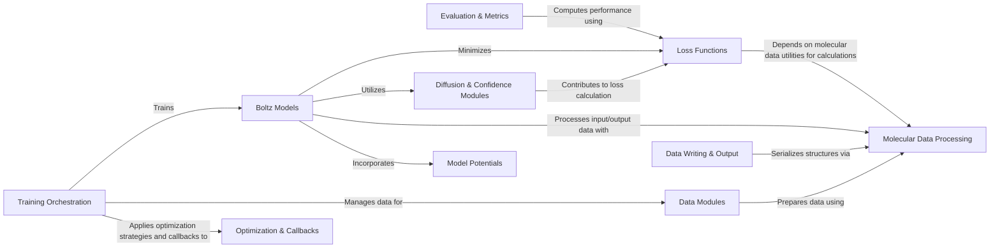

## Component Details

The Training & Evaluation Framework provides the essential infrastructure for developing and assessing Boltz models. It encompasses the definition of various loss functions, physical potential functions to guide molecular generation, and optimization utilities. The framework orchestrates the training process, manages data pipelines, handles the output of predicted structures, and evaluates model performance using a suite of metrics.

### Training Orchestration
This component is responsible for setting up and executing the training process for Boltz models. It handles configuration loading, model and data module instantiation, logger setup (e.g., Weights & Biases), checkpointing, and orchestrates the training and validation loops.

**Related Classes/Methods**:

- <a href="https://github.com/jwohlwend/boltz/blob/master/scripts/train/train.py#L80-L235" target="_blank" rel="noopener noreferrer">`boltz.scripts.train.train:train` (80:235)</a>

### Evaluation & Metrics
This component focuses on aggregating and computing various evaluation metrics, such as AF3, CHAI, and Boltz-specific metrics, to assess the performance of trained models.

**Related Classes/Methods**:

- <a href="https://github.com/jwohlwend/boltz/blob/master/scripts/eval/aggregate_evals.py#L297-L505" target="_blank" rel="noopener noreferrer">`boltz.scripts.eval.aggregate_evals:eval_models` (297:505)</a>

### Boltz Models
This component encompasses the core neural network architectures, Boltz1 and Boltz2, which are responsible for predicting protein structures. They define the training, validation, and prediction steps, integrating various sub-modules and loss functions.

**Related Classes/Methods**:

- `boltz.src.boltz.model.models.boltz1.Boltz1` (full file reference)
- `boltz.src.boltz.model.models.boltz2.Boltz2` (full file reference)

### Data Modules
This component manages the entire data pipeline, including loading raw input data (structures, MSAs), tokenization, featurization, padding, and creating datasets and dataloaders for both training and inference.

**Related Classes/Methods**:

- `boltz.src.boltz.data.module.training` (full file reference)
- `boltz.src.boltz.data.module.inference` (full file reference)
- `boltz.src.boltz.data.module.inferencev2` (full file reference)

### Loss Functions
This component provides a collection of loss functions crucial for training the Boltz models. These include losses related to confidence (pLDDT, pAE), diffusion, distograms, and b-factors, guiding the model's learning process.

**Related Classes/Methods**:

- `boltz.src.boltz.model.loss.validation` (full file reference)
- `boltz.src.boltz.model.loss.confidence` (full file reference)
- <a href="https://github.com/jwohlwend/boltz/blob/master/src/boltz/model/loss/confidencev2.py#L8-L87" target="_blank" rel="noopener noreferrer">`boltz.src.boltz.model.loss.confidencev2:confidence_loss` (8:87)</a>
- <a href="https://github.com/jwohlwend/boltz/blob/master/src/boltz/model/loss/distogram.py#L5-L48" target="_blank" rel="noopener noreferrer">`boltz.model.loss.distogram.distogram_loss` (5:48)</a>
- <a href="https://github.com/jwohlwend/boltz/blob/master/src/boltz/model/loss/distogramv2.py#L5-L105" target="_blank" rel="noopener noreferrer">`boltz.model.loss.distogramv2.distogram_loss` (5:105)</a>
- <a href="https://github.com/jwohlwend/boltz/blob/master/src/boltz/model/loss/bfactor.py#L5-L49" target="_blank" rel="noopener noreferrer">`boltz.model.loss.bfactor.bfactor_loss_fn` (5:49)</a>

### Diffusion & Confidence Modules
This component contains the specific neural network modules responsible for implementing the atom diffusion process and predicting confidence metrics (like pLDDT and pAE) within the Boltz models.

**Related Classes/Methods**:

- <a href="https://github.com/jwohlwend/boltz/blob/master/src/boltz/model/modules/diffusion.py#L284-L844" target="_blank" rel="noopener noreferrer">`boltz.src.boltz.model.modules.diffusion.AtomDiffusion` (284:844)</a>
- <a href="https://github.com/jwohlwend/boltz/blob/master/src/boltz/model/modules/diffusionv2.py#L179-L677" target="_blank" rel="noopener noreferrer">`boltz.src.boltz.model.modules.diffusionv2.AtomDiffusion` (179:677)</a>
- <a href="https://github.com/jwohlwend/boltz/blob/master/src/boltz/model/modules/confidence.py#L337-L481" target="_blank" rel="noopener noreferrer">`boltz.src.boltz.model.modules.confidence.ConfidenceHeads` (337:481)</a>
- <a href="https://github.com/jwohlwend/boltz/blob/master/src/boltz/model/modules/confidencev2.py#L240-L503" target="_blank" rel="noopener noreferrer">`boltz.src.boltz.model.modules.confidencev2.ConfidenceHeads` (240:503)</a>
- `boltz.src.boltz.model.layers.confidence_utils` (full file reference)
- `boltz.model.modules.confidence_utils` (full file reference)

### Data Writing & Output
This component handles the serialization of predicted protein structures into standard bioinformatics formats such as PDB and mmCIF, facilitating downstream analysis and visualization.

**Related Classes/Methods**:

- <a href="https://github.com/jwohlwend/boltz/blob/master/src/boltz/data/write/writer.py#L17-L254" target="_blank" rel="noopener noreferrer">`boltz.src.boltz.data.write.writer.BoltzWriter` (17:254)</a>
- <a href="https://github.com/jwohlwend/boltz/blob/master/src/boltz/data/write/mmcif.py#L17-L305" target="_blank" rel="noopener noreferrer">`boltz.src.boltz.data.write.mmcif:to_mmcif` (17:305)</a>
- <a href="https://github.com/jwohlwend/boltz/blob/master/src/boltz/data/write/pdb.py#L11-L171" target="_blank" rel="noopener noreferrer">`boltz.data.write.pdb.to_pdb` (11:171)</a>

### Optimization & Callbacks
This component provides utilities for optimizing model training, including learning rate schedulers (e.g., AlphaFoldLRScheduler) and callbacks like Exponential Moving Average (EMA) for improving model stability and performance.

**Related Classes/Methods**:

- <a href="https://github.com/jwohlwend/boltz/blob/master/src/boltz/model/optim/ema.py#L14-L389" target="_blank" rel="noopener noreferrer">`boltz.src.boltz.model.optim.ema.EMA` (14:389)</a>
- <a href="https://github.com/jwohlwend/boltz/blob/master/src/boltz/model/optim/scheduler.py#L4-L99" target="_blank" rel="noopener noreferrer">`boltz.model.optim.scheduler.AlphaFoldLRScheduler` (4:99)</a>
- <a href="https://github.com/jwohlwend/boltz/blob/master/src/boltz/model/modules/utils.py#L103-L207" target="_blank" rel="noopener noreferrer">`boltz.model.modules.utils.ExponentialMovingAverage` (103:207)</a>

### Molecular Data Processing
This component offers a suite of utilities for manipulating and preparing molecular data. This includes tokenization of sequences, featurization of structural information, padding operations for batching, and handling symmetry-related transformations.

**Related Classes/Methods**:

- `boltz.src.boltz.data.mol` (full file reference)
- `boltz.src.boltz.data.feature.symmetry` (full file reference)
- <a href="https://github.com/jwohlwend/boltz/blob/master/src/boltz/data/pad.py#L6-L32" target="_blank" rel="noopener noreferrer">`boltz.data.pad.pad_dim` (6:32)</a>
- <a href="https://github.com/jwohlwend/boltz/blob/master/src/boltz/data/tokenize/boltz.py#L32-L195" target="_blank" rel="noopener noreferrer">`boltz.data.tokenize.boltz.BoltzTokenizer` (32:195)</a>
- <a href="https://github.com/jwohlwend/boltz/blob/master/src/boltz/data/tokenize/boltz2.py#L349-L396" target="_blank" rel="noopener noreferrer">`boltz.data.tokenize.boltz2.Boltz2Tokenizer` (349:396)</a>
- `boltz.data.feature.featurizer.BoltzFeaturizer` (full file reference)
- `boltz.data.feature.featurizerv2.Boltz2Featurizer` (full file reference)
- <a href="https://github.com/jwohlwend/boltz/blob/master/src/boltz/data/crop/affinity.py#L11-L164" target="_blank" rel="noopener noreferrer">`boltz.data.crop.affinity.AffinityCropper` (11:164)</a>
- <a href="https://github.com/jwohlwend/boltz/blob/master/src/boltz/data/mol.py#L42-L56" target="_blank" rel="noopener noreferrer">`boltz.data.mol.load_canonicals` (42:56)</a>
- <a href="https://github.com/jwohlwend/boltz/blob/master/src/boltz/data/mol.py#L16-L39" target="_blank" rel="noopener noreferrer">`boltz.data.mol.load_molecules` (16:39)</a>
- <a href="https://github.com/jwohlwend/boltz/blob/master/src/boltz/data/types.py#L15-L44" target="_blank" rel="noopener noreferrer">`boltz.data.types.NumpySerializable` (15:44)</a>
- <a href="https://github.com/jwohlwend/boltz/blob/master/src/boltz/data/types.py#L169-L319" target="_blank" rel="noopener noreferrer">`boltz.data.types.Structure` (169:319)</a>
- <a href="https://github.com/jwohlwend/boltz/blob/master/src/boltz/data/types.py#L469-L474" target="_blank" rel="noopener noreferrer">`boltz.data.types.MSA` (469:474)</a>
- <a href="https://github.com/jwohlwend/boltz/blob/master/src/boltz/data/types.py#L692-L700" target="_blank" rel="noopener noreferrer">`boltz.data.types.Input` (692:700)</a>
- <a href="https://github.com/jwohlwend/boltz/blob/master/src/boltz/data/types.py#L323-L441" target="_blank" rel="noopener noreferrer">`boltz.data.types.StructureV2` (323:441)</a>
- <a href="https://github.com/jwohlwend/boltz/blob/master/src/boltz/data/types.py#L647-L683" target="_blank" rel="noopener noreferrer">`boltz.data.types.Manifest` (647:683)</a>

### Model Potentials
This component defines various potential functions that can be incorporated into the Boltz models, likely to enforce physical or chemical constraints during structure prediction, such as Van der Waals overlap or bond stereochemistry.

**Related Classes/Methods**:

- <a href="https://github.com/jwohlwend/boltz/blob/master/src/boltz/model/potentials/potentials.py#L417-L482" target="_blank" rel="noopener noreferrer">`boltz.src.boltz.model.potentials.potentials:get_potentials` (417:482)</a>
- <a href="https://github.com/jwohlwend/boltz/blob/master/src/boltz/model/potentials/schedules.py#L8-L18" target="_blank" rel="noopener noreferrer">`boltz.model.potentials.schedules.ExponentialInterpolation` (8:18)</a>
- <a href="https://github.com/jwohlwend/boltz/blob/master/src/boltz/model/potentials/schedules.py#L20-L32" target="_blank" rel="noopener noreferrer">`boltz.model.potentials.schedules.PiecewiseStepFunction` (20:32)</a>

### [FAQ](https://github.com/CodeBoarding/GeneratedOnBoardings/tree/main?tab=readme-ov-file#faq)