```mermaid
graph LR
    Application_Orchestration["Application Orchestration"]
    Boltz_Core_Models["Boltz Core Models"]
    Neural_Network_Architecture["Neural Network Architecture"]
    Data_Processing_Feature_Engineering["Data Processing & Feature Engineering"]
    Data_Management_Augmentation["Data Management & Augmentation"]
    Training_Evaluation_Framework["Training & Evaluation Framework"]
    General_Utilities["General Utilities"]
    Application_Orchestration -- "orchestrates" --> Boltz_Core_Models
    Application_Orchestration -- "processes inputs using" --> Data_Processing_Feature_Engineering
    Boltz_Core_Models -- "utilizes" --> Neural_Network_Architecture
    Boltz_Core_Models -- "trained and evaluated by" --> Training_Evaluation_Framework
    Boltz_Core_Models -- "consumes data from" --> Data_Management_Augmentation
    Neural_Network_Architecture -- "provides building blocks for" --> Boltz_Core_Models
    Neural_Network_Architecture -- "uses" --> General_Utilities
    Data_Processing_Feature_Engineering -- "prepares data for" --> Data_Management_Augmentation
    Data_Processing_Feature_Engineering -- "provides processed data to" --> Application_Orchestration
    Data_Management_Augmentation -- "supplies data to" --> Boltz_Core_Models
    Data_Management_Augmentation -- "receives data from" --> Data_Processing_Feature_Engineering
    Training_Evaluation_Framework -- "optimizes and evaluates" --> Boltz_Core_Models
    Training_Evaluation_Framework -- "uses data from" --> Data_Management_Augmentation
    General_Utilities -- "supports" --> Neural_Network_Architecture
    General_Utilities -- "supports" --> Data_Processing_Feature_Engineering
    click Application_Orchestration href "https://github.com/CodeBoarding/GeneratedOnBoardings/blob/main/boltz/Application Orchestration.md" "Details"
    click Boltz_Core_Models href "https://github.com/CodeBoarding/GeneratedOnBoardings/blob/main/boltz/Boltz Core Models.md" "Details"
    click Neural_Network_Architecture href "https://github.com/CodeBoarding/GeneratedOnBoardings/blob/main/boltz/Neural Network Architecture.md" "Details"
    click Data_Processing_Feature_Engineering href "https://github.com/CodeBoarding/GeneratedOnBoardings/blob/main/boltz/Data Processing & Feature Engineering.md" "Details"
    click Data_Management_Augmentation href "https://github.com/CodeBoarding/GeneratedOnBoardings/blob/main/boltz/Data Management & Augmentation.md" "Details"
    click Training_Evaluation_Framework href "https://github.com/CodeBoarding/GeneratedOnBoardings/blob/main/boltz/Training & Evaluation Framework.md" "Details"
    click General_Utilities href "https://github.com/CodeBoarding/GeneratedOnBoardings/blob/main/boltz/General Utilities.md" "Details"
```

## Component Details

The Boltz project is a molecular modeling framework primarily focused on predicting and generating molecular structures and their properties, such as binding affinity and confidence. The core functionality revolves around neural network models (Boltz1 and Boltz2) that leverage diffusion processes for structure generation. The system handles comprehensive data processing, from parsing raw molecular data and performing feature engineering to managing data loading and augmentation for efficient training. It includes a robust training and evaluation framework with various loss functions, physical potentials, and optimization utilities. The overall application workflow is orchestrated to manage the flow of data and execution across these specialized modules, with general utilities supporting various operations throughout the pipeline.

### Application Orchestration
Serves as the central control unit for the Boltz application, managing the overall workflow from input processing to model prediction. It coordinates data flow and execution across different modules.

**Related Classes/Methods**:

- <a href="https://github.com/jwohlwend/boltz/blob/master/src/boltz/main.py#L311-L352" target="_blank" rel="noopener noreferrer">`boltz.src.boltz.main:filter_inputs_structure` (311:352)</a>
- <a href="https://github.com/jwohlwend/boltz/blob/master/src/boltz/main.py#L477-L605" target="_blank" rel="noopener noreferrer">`boltz.src.boltz.main:process_input` (477:605)</a>
- <a href="https://github.com/jwohlwend/boltz/blob/master/src/boltz/main.py#L933-L999" target="_blank" rel="noopener noreferrer">`boltz.src.boltz.main:predict` (933:999)</a>

### Boltz Core Models
Encapsulates the primary Boltz neural network architectures (Boltz1, Boltz2), including their forward passes, training, validation, and prediction steps. It integrates diffusion, confidence, and affinity prediction capabilities.

**Related Classes/Methods**:

- <a href="https://github.com/jwohlwend/boltz/blob/master/src/boltz/model/models/boltz2.py#L16-L300" target="_blank" rel="noopener noreferrer">`boltz.src.boltz.model.models.boltz2.Boltz2` (16:300)</a>
- <a href="https://github.com/jwohlwend/boltz/blob/master/src/boltz/model/models/boltz1.py#L16-L300" target="_blank" rel="noopener noreferrer">`boltz.src.boltz.model.models.boltz1.Boltz1` (16:300)</a>
- <a href="https://github.com/jwohlwend/boltz/blob/master/src/boltz/model/modules/diffusionv2.py#L179-L677" target="_blank" rel="noopener noreferrer">`boltz.src.boltz.model.modules.diffusionv2.AtomDiffusion` (179:677)</a>
- <a href="https://github.com/jwohlwend/boltz/blob/master/src/boltz/model/modules/confidencev2.py#L19-L237" target="_blank" rel="noopener noreferrer">`boltz.src.boltz.model.modules.confidencev2.ConfidenceModule` (19:237)</a>
- <a href="https://github.com/jwohlwend/boltz/blob/master/src/boltz/model/modules/affinity.py#L34-L135" target="_blank" rel="noopener noreferrer">`boltz.src.boltz.model.modules.affinity.AffinityModule` (34:135)</a>

### Neural Network Architecture
Provides the fundamental building blocks for the Boltz models, including input embedding, MSA and pairformer modules, various encoders (single, pairwise, atom attention), transformer blocks, and core neural network layers like attention mechanisms and triangular multiplications.

**Related Classes/Methods**:

- <a href="https://github.com/jwohlwend/boltz/blob/master/src/boltz/model/modules/trunk.py#L24-L113" target="_blank" rel="noopener noreferrer">`boltz.src.boltz.model.modules.trunk.InputEmbedder` (24:113)</a>
- <a href="https://github.com/jwohlwend/boltz/blob/master/src/boltz/model/modules/trunk.py#L116-L289" target="_blank" rel="noopener noreferrer">`boltz.src.boltz.model.modules.trunk.MSAModule` (116:289)</a>
- <a href="https://github.com/jwohlwend/boltz/blob/master/src/boltz/model/modules/encoders.py#L288-L540" target="_blank" rel="noopener noreferrer">`boltz.src.boltz.model.modules.encoders.AtomAttentionEncoder` (288:540)</a>
- <a href="https://github.com/jwohlwend/boltz/blob/master/src/boltz/model/modules/transformersv2.py#L68-L137" target="_blank" rel="noopener noreferrer">`boltz.src.boltz.model.modules.transformersv2.DiffusionTransformer` (68:137)</a>
- <a href="https://github.com/jwohlwend/boltz/blob/master/src/boltz/model/layers/triangular_attention/attention.py#L33-L162" target="_blank" rel="noopener noreferrer">`boltz.src.boltz.model.layers.triangular_attention.attention.TriangleAttention` (33:162)</a>

### Data Processing & Feature Engineering
Manages the parsing of raw input data (MMCIF, FASTA, YAML, CSV, A3M) into internal data structures, followed by comprehensive featurization and tokenization processes. This includes generating token, atom, MSA, template, and symmetry features, and handling molecular geometry and constraints.

**Related Classes/Methods**:

- <a href="https://github.com/jwohlwend/boltz/blob/master/src/boltz/data/types.py#L169-L319" target="_blank" rel="noopener noreferrer">`boltz.src.boltz.data.types.Structure` (169:319)</a>
- <a href="https://github.com/jwohlwend/boltz/blob/master/src/boltz/data/parse/mmcif_with_constraints.py#L200-L300" target="_blank" rel="noopener noreferrer">`boltz.src.boltz.data.parse.mmcif_with_constraints:parse_mmcif` (200:300)</a>
- <a href="https://github.com/jwohlwend/boltz/blob/master/src/boltz/data/feature/featurizer.py#L100-L200" target="_blank" rel="noopener noreferrer">`boltz.src.boltz.data.feature.featurizer.BoltzFeaturizer:process` (100:200)</a>
- <a href="https://github.com/jwohlwend/boltz/blob/master/src/boltz/data/tokenize/boltz.py#L35-L195" target="_blank" rel="noopener noreferrer">`boltz.src.boltz.data.tokenize.boltz.BoltzTokenizer:tokenize` (35:195)</a>
- <a href="https://github.com/jwohlwend/boltz/blob/master/src/boltz/data/msa/mmseqs2.py#L20-L254" target="_blank" rel="noopener noreferrer">`boltz.src.boltz.data.msa.mmseqs2:run_mmseqs2` (20:254)</a>

### Data Management & Augmentation
Handles the loading, batching, sampling, and cropping of prepared data for training, validation, and inference. It includes various sampling strategies (cluster, random, distillation) and mechanisms to filter and augment data subsets for efficient model processing.

**Related Classes/Methods**:

- <a href="https://github.com/jwohlwend/boltz/blob/master/src/boltz/data/module/training.py#L491-L684" target="_blank" rel="noopener noreferrer">`boltz.src.boltz.data.module.training.BoltzTrainingDataModule` (491:684)</a>
- <a href="https://github.com/jwohlwend/boltz/blob/master/src/boltz/data/module/inference.py#L249-L271" target="_blank" rel="noopener noreferrer">`boltz.src.boltz.data.module.inference.BoltzInferenceDataModule:predict_dataloader` (249:271)</a>
- <a href="https://github.com/jwohlwend/boltz/blob/master/src/boltz/data/sample/cluster.py#L204-L283" target="_blank" rel="noopener noreferrer">`boltz.src.boltz.data.sample.cluster.ClusterSampler:sample` (204:283)</a>
- <a href="https://github.com/jwohlwend/boltz/blob/master/src/boltz/data/crop/boltz.py#L150-L296" target="_blank" rel="noopener noreferrer">`boltz.src.boltz.data.crop.boltz.BoltzCropper:crop` (150:296)</a>
- <a href="https://github.com/jwohlwend/boltz/blob/master/src/boltz/data/filter/static/polymer.py#L202-L299" target="_blank" rel="noopener noreferrer">`boltz.src.boltz.data.filter.static.polymer.ClashingChainsFilter:filter` (202:299)</a>

### Training & Evaluation Framework
Provides the infrastructure for training Boltz models, including defining various loss functions (confidence, diffusion, validation metrics), physical potential functions to guide molecular generation, and optimization utilities like learning rate schedulers and Exponential Moving Average (EMA). It also handles outputting predicted structures and evaluating model performance.

**Related Classes/Methods**:

- <a href="https://github.com/jwohlwend/boltz/blob/master/src/boltz/model/loss/confidencev2.py#L8-L87" target="_blank" rel="noopener noreferrer">`boltz.src.boltz.model.loss.confidencev2:confidence_loss` (8:87)</a>
- <a href="https://github.com/jwohlwend/boltz/blob/master/src/boltz/model/potentials/potentials.py#L417-L482" target="_blank" rel="noopener noreferrer">`boltz.src.boltz.model.potentials.potentials:get_potentials` (417:482)</a>
- <a href="https://github.com/jwohlwend/boltz/blob/master/src/boltz/model/optim/ema.py#L14-L389" target="_blank" rel="noopener noreferrer">`boltz.src.boltz.model.optim.ema.EMA` (14:389)</a>
- <a href="https://github.com/jwohlwend/boltz/blob/master/scripts/train/train.py#L80-L235" target="_blank" rel="noopener noreferrer">`boltz.scripts.train.train:train` (80:235)</a>
- <a href="https://github.com/jwohlwend/boltz/blob/master/src/boltz/data/write/mmcif.py#L17-L305" target="_blank" rel="noopener noreferrer">`boltz.src.boltz.data.write.mmcif:to_mmcif` (17:305)</a>
- <a href="https://github.com/jwohlwend/boltz/blob/master/scripts/eval/aggregate_evals.py#L297-L505" target="_blank" rel="noopener noreferrer">`boltz.scripts.eval.aggregate_evals:eval_models` (297:505)</a>

### General Utilities
A collection of miscellaneous utility functions supporting various operations across the project, such as default value handling, random augmentations (rotations, quaternions), and centering operations.

**Related Classes/Methods**:

- <a href="https://github.com/jwohlwend/boltz/blob/master/src/boltz/model/modules/utils.py#L21-L22" target="_blank" rel="noopener noreferrer">`boltz.src.boltz.model.modules.utils:default` (21:22)</a>
- <a href="https://github.com/jwohlwend/boltz/blob/master/src/boltz/model/modules/utils.py#L56-L64" target="_blank" rel="noopener noreferrer">`boltz.src.boltz.model.modules.utils:randomly_rotate` (56:64)</a>

### [FAQ](https://github.com/CodeBoarding/GeneratedOnBoardings/tree/main?tab=readme-ov-file#faq)